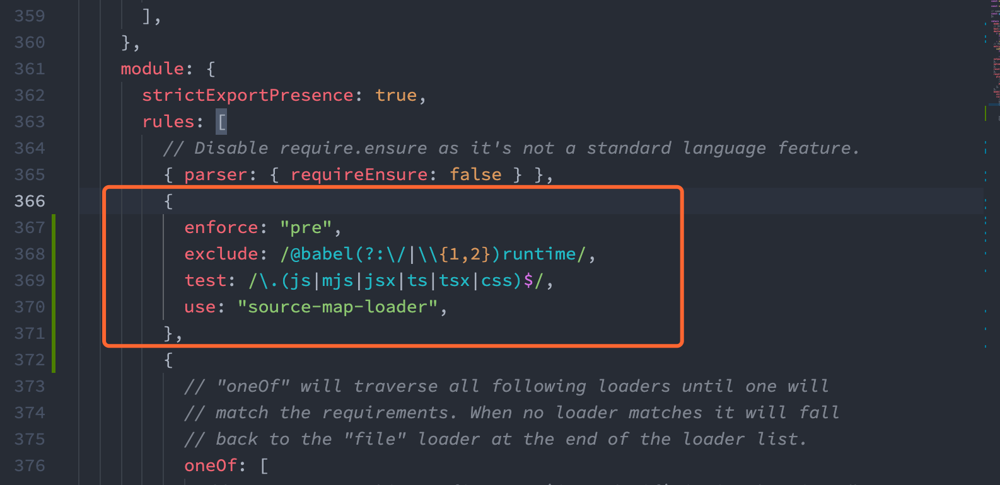

如何调试、阅读源码

以分为单元测试调试，和集成测试调试。这样分读者不好理解，还是放弃。

集成测试可分为：浏览器端、Shell 端。

先说明本文的目的。阅读源码是对某块逻辑不熟悉，线上工程出问题了，需要定位三方库源码问题。

分为浏览器端和 Node 端，分类的依据是在该库是否需要进行浏览器渲染。

# 浏览器端

## 基础调试流程

随便找个 React 的 CodeSandbox 进行截几个图。

1. cmd + shift + i
2. cmd + p
3. 输入文件的路径名，回车
4. 打断点即可。

## 启动源码项目中的 examples 或 demos

https://github.com/chenglou/react-motion

https://github.com/react-component/tooltip/blob/master/docs/examples/arrowContent.tsx 中执行 `yarn start`。

打开 浏览器端，

## 通过测试代码

use-swr

缺点是：需要将真实问题修改为测试用例，比较麻烦。

##  通过依赖的方式测试真实环境

### 构建本地源码、产出 SourceMap

检查构建后的代码中是否有 SourceMap 文件，如果有则跳过该步骤。

1. 这种方式需要对源码进行构建，产出构建产物。如果构建产物中没有 source_map，则需要进行修改。例如 useSWR 中需要在 tsconfig.json 中加上 `"sourceMap": true,`。

```bash
mv node_modules .git/node_modules

# build 后将 node_modules 删掉。使用 mv 是为了提速
mv node_modules .git/node_modules
```

### 启动测试项目、开始调试源码

如果不是在已有项目上进行调试，则需要先创建测试项目。如下所示，通过 create-react-app 创建 React 测试项目，其他技术栈类似。

```bash
npx create-react-app cra-swr
```

将本地源码作为测试项目的依赖。在测试项目的 package.json 将依赖的版本改为绝对路径的方式，如："swr": "file:/Users/chengang.07/git-source/github.com/vercel/swr/",

测试项目需要支持 node_modules 中的 source map。在新创建的 React 测试项目中执行 `yarn eject`。
添加 source-map-loader 依赖，执行 `yarn add -D source-map-loader@1.1.3`。如果 webpack 不是 v5 版本的，source-map-loader 一定要使用 v1 版本，不要使用 v2 版本。原因是 source-map-loader@2 使用了 webpack@5 中提供的 [getOptions API](https://webpack.js.org/migrate/5/#getoptions-method-for-loaders)。

在 config/webpack.config.js 文件中的 module.rules 字段增加如下值。

```js
{
  enforce: "pre",
  exclude: /@babel(?:\/|\\{1,2})runtime/,
  test: /\.(js|mjs|jsx|ts|tsx|css)$/,
  use: "source-map-loader",
},
```

添加后截图如下所示：


###

# Node 端

## 基础调试流程

VSCode 版本

WebStorm 版本

# useSWR

1. 源码中的 examples 是通过通过 README
