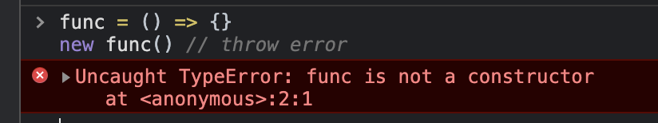
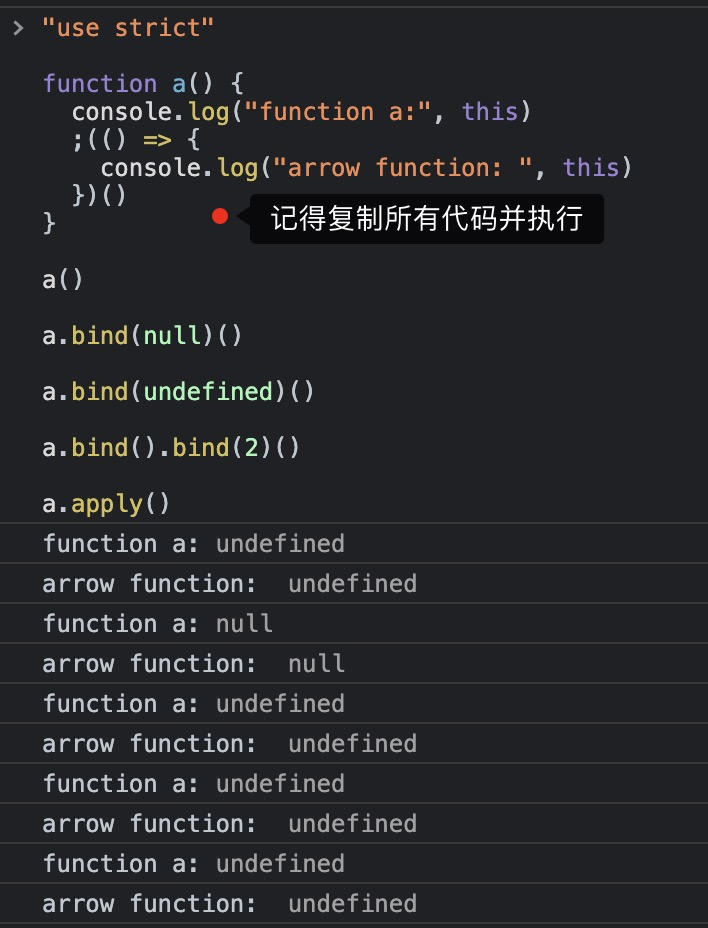

# this 指向问题，全网最全最简单口诀

Believe Me，只要背诵本文的 7️⃣ 步口诀，就能成为 JS this 专家。

先念口诀：箭头、new、bind、apply 或 call、欧比届点（obj.）、直接调用、不在函数里。

按照口诀的顺序，只要满足前面某个场景，就可以确定 this 指向了，也不用考虑后面的场景了。

接下来按照口诀顺序对它们进行详解， 示例代码除非特别说明都运行在 Chrome 的 Console 控制面中。

# 1. 箭头函数

箭头函数排在第一个是因为它的 this 是不能被改变的，所以只要当前函数是箭头函数，那么就不用再看其他规则了。

箭头函数的 this 是在创建它时外层 this 的指向，这里的重点有两个：

1. **创建箭头函数时**，就已经确定了它的 this 指向。
2. this 指向外层的 this。

所以要知道箭头函数的 this 就得先知道外层 this 的指向，就需要继续在外层应用七步口诀。

# 2. new

**当使用 new 关键字调用函数时，函数中的 this 一定是 JS 创建的新对象。**

读者可能会有疑问，“如果使用 new 关键调用箭头函数，是不是箭头函数的 this 就会被修改呢？”。

我们在控制台试一下。

```js
func = () => {}
new func() // throw error
```



从控制台中可以看出，箭头函数并不能当做构造函数，不能与 new 一起执行。

# 3. bind

bind 是指 [Function.prototype.bind()](https://developer.mozilla.org/zh-CN/docs/Web/JavaScript/Reference/Global_Objects/Function/bind)。

## 多次 bind 时 this 为第一次 bind 的值

这点经常出错。

```js
function func() {
  console.log(this)
}

func.bind(1).bind(2)() // 1
```

## bind 与箭头函数

```js
func = () => {
  // 这里 this 指向取决于外层 this，参考口诀 7 「不在函数里」
  console.log(this)
}

func.bind(1)() // Window，口诀 1 优先
```

## bind 与 new

**易错点**

```js
function func() {
  console.log(this, this.__proto__ === func.prototype)
}

boundFunc = func.bind(1)
new boundFunc() // Object true，口诀 2 优先
```

# 4. apply 或 call

`apply()` 和 `call()` 的第一个参数都是 this，区别在于通过 apply 调用时实参是放到数组中的，而通过 call 调用时实参是逗号分隔的。

## 箭头函数中 this 不会被修改

**易错点**

```js
func = () => {
  // 这里 this 指向取决于外层 this，参考口诀 7 「不在函数里」
  console.log(this)
}

func.apply(1) // Window，口诀 1 优先
```

## bind 函数不会被修改

**易错点**

```js
function func() {
  console.log(this)
}

boundFunc = func.bind(1)
boundFunc.apply(2) // 1，口诀 3 优先
```

# 5. 欧比届点（obj.）

```js
function func() {
  console.log(this)
}

obj = { x: 1 }
obj.func = func
obj.func() // { x: 1 }
```

这里就不用代码例证箭头函数和 bind 函数的优先级更高了，有兴趣可自行尝试吧。

# 6. 直接调用

在函数不满足前面的场景，被直接调用时，this 将指向全局对象。在浏览器环境中全局对象是 Window，在 Node.js 环境中是 Global。

先来个简单的例子。

```js
function func() {
  console.log(this)
}

func() // Window
```

来一个复杂的例子，外层的 outerFunc 就起个迷惑目的。

```js
function outerFunc() {
  console.log(this) // { x: 1 }

  function func() {
    console.log(this) // Window
  }

  func()
}

outerFunc.bind({ x: 1 })()
```

# 7. 不在函数里

不在函数中的场景，可分为浏览器的 `<script />` 标签里，或 Node.js 的模块文件里。

1. 在 `<script />` 标签里，this 指向 Window。
2. 在 Node.js 的模块文件里，this 指向 Module 的默认导出对象，也就是 module.exports。

# 严格模式与正常模式的区别

很多同学经常说“在严格模式直接调用函数时，this 指向 undefined，而在非严格模式 this 指向全局对象”，这是不严谨的。

实际上在严格模式下 this 可以为 undefined 或 null，而在正常模式下，this 不可能为 undefined 或 null。

在正常模式下，通过上面七步口诀，如果得出 this 指向是 undefined 或 null，那么 this 会指向全局对象。在浏览器环境中全局对象是 Window，在 Node.js 环境中是 Global。

例如下面的代码，在正常模式下，this 都指向全局对象。

```js
function a() {
  console.log("function a:", this)
  ;(() => {
    console.log("arrow function: ", this)
  })()
}

a()

a.bind(null)()

a.bind(undefined)()

a.bind().bind(2)()

a.apply()
```

在严格模式下，执行同样的代码进行对比。记住要一次性将所有代码在控制台中，一次执行，才能运行在严格模式中。

```js
"use strict"

function a() {
  console.log("function a:", this)
  ;(() => {
    console.log("arrow function: ", this)
  })()
}

a()

a.bind(null)()

a.bind(undefined)()

a.bind().bind(2)()

a.apply()
```

严格模式下执行结果为：



# 做题复习

先背诵口诀再做题，“箭头、new、bind、apply 或 call、欧比届点（obj.）、直接调用、不在函数里”。

## 下面代码执行后，func.count 值为多少？

```js
function func(num) {
  console.log(num)
  this.count++
}

func.count = 0
func(1) // 1
func(2) // 2
func(3) // 3
```

---

### 答案

func.count 值为 0。

按照口诀，`func()` 调用时属于第 6 类「直接调用」。在非严格模式下，`this` 指向全局对象。`this` 跟 func 一点关系都没有，所以 `func.count` 保持不变。

## 以下代码中箭头函数指向谁？

```js
obj = {
  func() {
    const arrowFunc = () => {
      console.log(this._name)
    }

    return arrowFunc
  },

  _name: "obj",
}

obj.func()()

func = obj.func
func()()

obj.func.bind({ _name: "newObj" })()()
obj.func.bind()()()
```

### 答案

```js
// obj
// undefined
// newObj
// undefined
```

你学废了吗？
