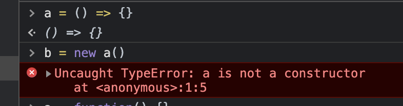

# this 指向问题，全网最全最简单口诀

只要能背诵本文的 7️⃣ 步口诀，就能成为 JS this 专家。先念口诀：箭头、new、bind、apply 或 call、欧比届点（obj.）、直接调用、不在函数里。按照口诀的顺序，只要满足某一项场景，就可以确定 this 指向了，后面的场景都不用考虑了。至于为什么，且看下文详解。

# 箭头函数

箭头函数排在第一个是因为它的 this 是不能被改变的，所以只要当前函数是箭头函数，那么就不用再看其他规则了。

箭头函数的 this 是在创建它时外层 this 的指向，这里的重点有两个：

1. **创建箭头函数时**，就已经确定了它的 this 指向。
2. this 指向外层的 this。

所以要知道箭头函数的 this 就得先知道外层 this 的指向，就需要继续在外层应用七步口诀。

# new

**当使用 new 关键字调用函数时，函数中的 this 一定是 JS 创建的新对象。**

读者可能会有疑问，“如果使用 new 关键调用箭头函数，是不是箭头函数的 this 就会被修改呢？”。

我们在控制台试一下。


从控制台中可以看出，箭头函数并不能当做构造函数，与 new 关键字一起执行。

# bind

bind 是指 [Function.prototype.bind()](https://developer.mozilla.org/zh-CN/docs/Web/JavaScript/Reference/Global_Objects/Function/bind)。

# apply 或 call

# 欧比届点（obj.）

# 直接调用

# 不在函数里

不在函数中的场景，可分为浏览器的 `<script />` 标签里，或 Node.js 的模块里。

1. 在 `<script />` 标签里，this 指向 Window。
2. 在 Node.js 的模块里，this 指向 Module 的默认导出对象，也就是 module.exports。

# 非严格模式

上面七步口诀在严格模式下已经够用了，但在非严格模式下还需要考虑 this 为 undefined 或 null 的情况。

很多同学经常说“在严格模式直接调用函数时，this 指向 undefined，而在非严格模式 this 指向全局对象”，这是不严谨的。

实际上在非严格模式下，this 不可能为 undefined 或 null。所以如果在非严格模式下，通过上面七步口诀得出 this 是 undefined 或 null，那么 this 会被指向全局对象。在浏览器环境中全局对象是 Window，在 Node.js 环境中是 Global。

例如下面的代码，在非严格模式下，this 都指向全局对象。

```js
function a() {
  console.log("function a:", this)
  ;(() => {
    console.log("arrow function: ", this)
  })()
}

a()

a.bind(null)()

a.bind(undefined)()

a.bind().bind(2)()

a.apply()
```

# 做题复习

请背诵口诀并做题，“箭头、new、bind、apply 或 call、欧比届点（obj.）、直接调用”。

## 下面代码执行后，func.count 值为多少？

```js
function func(num) {
  console.log(num)
  this.count++
}

func.count = 0
func(1) // 1
func(2) // 2
func(3) // 3
```

---

### 答案

func.count 值为 0。

按照口诀，`func()` 调用时属于第 6 类「直接调用」。在非严格模式下，`this` 指向全局对象。`this` 跟 func 一点关系都没有，所以 `func.count` 保持不变。

## 以下代码中箭头函数指向谁？

```js
```
