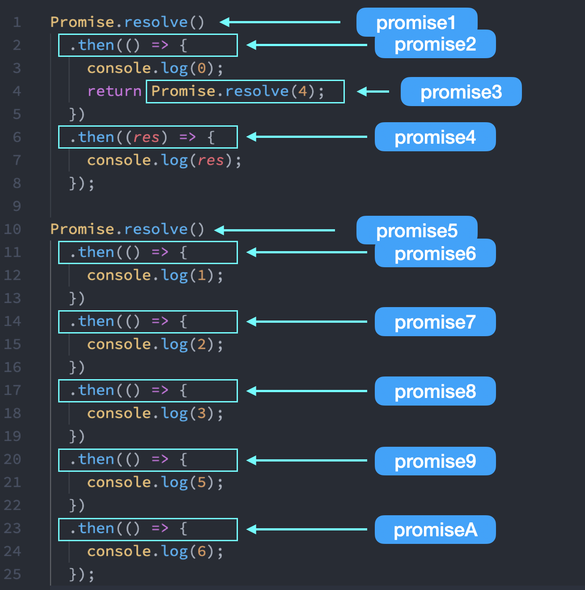

# Promise 面试题，从 ECMA 规范一步步解释

关于 Promise 的面试题，掘金上很多文章都有讨论，例如：[从一道让我失眠的 Promise 面试题开始，深入分析 Promise 实现细节](https://juejin.cn/post/6945319439772434469)、[我以为我很懂 Promise，直到我开始实现 Promise/A+规范 | 技术点评](https://juejin.cn/post/6945319439772434469)等等。

本文将从 ECMA 规范的角度，一步步推出结论。

# Promise 面试题。

```js
Promise.resolve()
  .then(() => {
    console.log(0)
    return Promise.resolve(4)
  })
  .then(res => {
    console.log(res)
  })

Promise.resolve()
  .then(() => {
    console.log(1)
  })
  .then(() => {
    console.log(2)
  })
  .then(() => {
    console.log(3)
  })
  .then(() => {
    console.log(5)
  })
  .then(() => {
    console.log(6)
  })
```

先通过 xx 说下结论。

## 结论

以上代码输出结果为：**0 1 2 3 4 5 6 7**。

如果你觉得输出结果是 **0 1 2 4 3 5 6 7**，那就是**经典错误**。

接下来通过代码执行过程，一步步进行分析。

### 0. 命名 Promise

对代码中生成的所有 Promise 进行命名，方便后续说明。



### 1. 第一轮执行

### 2. 第二轮执行后

### 3. 第三轮执行后

### 4. 剩余代码
