# Promise 面试题，从 ECMA 规范一步步详解

# 前言

关于 Promise 的面试题，虽然已经有很多文章讨论过，但在我看来，它们很难让读者明白为什么。

所以本文打算从不同角度来解释这个问题，尝试从 ECMA 规范的角度，带领大家通过规范一步步得出结论。

如果读者学会了该方法，以后再遇到其他问题，也可以通过查阅规范进行求解。

因为阅读规范确实很有难度，所以**如果读者时间有限，建议只读第一章节即可**。

# Promise 面试题

```js
Promise.resolve()
  .then(() => {
    console.log(0)
    return Promise.resolve(4)
  })
  .then(res => {
    console.log(res)
  })

Promise.resolve()
  .then(() => {
    console.log(1)
  })
  .then(() => {
    console.log(2)
  })
  .then(() => {
    console.log(3)
  })
  .then(() => {
    console.log(5)
  })
  .then(() => {
    console.log(6)
  })
```

## 答案

以上代码输出结果为：**0 1 2 3 4 5 6 7**。

如果你觉得输出结果是 **0 1 2 4 3 5 6 7**，那就是**经典错误**。

## 命名 Promise

对代码中生成的所有 Promise 进行命名，方便后续说明。


## 经典错误的原因

如果只看面试代码的前一部分，这份代码共产生了多少个微任务呢？

```js
Promise.resolve()
  .then(() => {
    console.log(0)
    return Promise.resolve(4)
  })
  .then(res => {
    console.log(res)
  })
```

第一个微任务是执行 `promise1.then()` 的回调，其伪代码如下。

```js
function job1() {
  const cb = () => {
    console.log(0)
    return Promise.resolve(4)
  }

  const promise3 = cb()

  // 生成第二个微任务
  resolvePromise2(promise3)
}
```

因为 resolvePromise2 的参数是 promise 对象，所以生成第二个微任务。

**第二个微任务就是这道面试题的核心，我们得出经典错误的原因就是忽略了该微任务。**

第二个微任务将 promise2 和 promise3 关联起来，其伪代码如下。

```js
function job2() {
  // 生成第三个微任务
  promise3.then(resolvePromise2, rejectPromise2)
}
```

在第二个微任务中，因为 promise3 的状态是 fulfilled，所以调用 `.then(cb)` 将生成第三个微任务，微任务内容是 resolvePromise2。

第三个微任务是调用 `promise3.then()` 回调函数，即执行 `resolvePromise2(4)`。

```js
function job3() {
  // 生成第四个微任务
  resolvePromise2(4)
}
```

因为 promise2 的状态为 fulfilled 且它还有 then 回调函数，所以将生成第四个微任务。

第四个微任务就是调用 `promise2.then()` 的回调函数。

```js
function job4() {
  const cb = res => {
    console.log(res)
  }

  const result = cb()
  // result 是 undefined
  resolvePromise4(result)
}
```

因为 promise4 后面没有 then 回调，所以不会生成新的微任务。

**因此如果只看面试代码的前一部分，这份代码共产生了四个微任务。**

## 画图理解

### 1. 第一轮执行

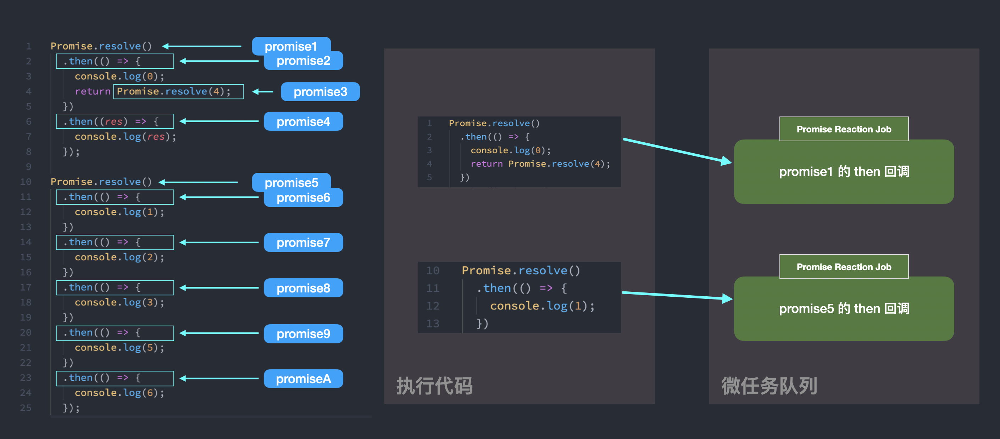

### 2. 执行两个微任务

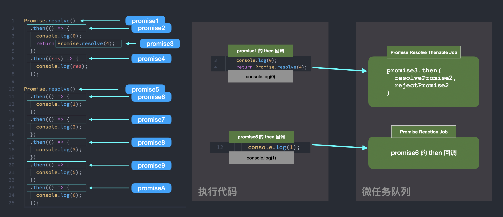

### 3. 执行两个微任务

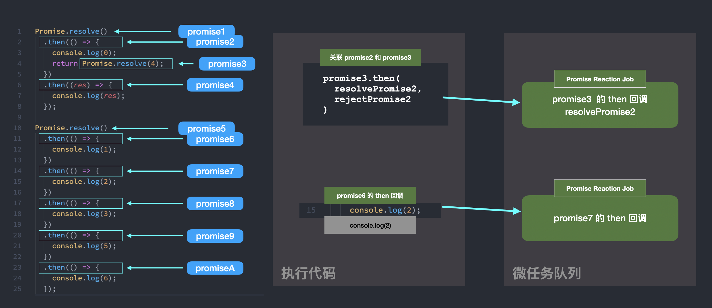

### 4. 执行两个微任务

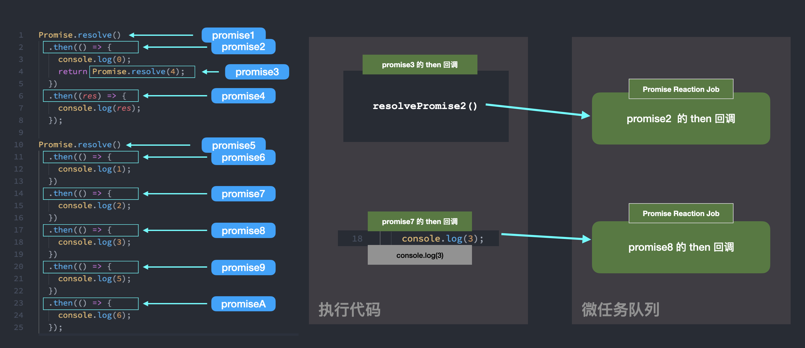

### 5. 执行两个微任务

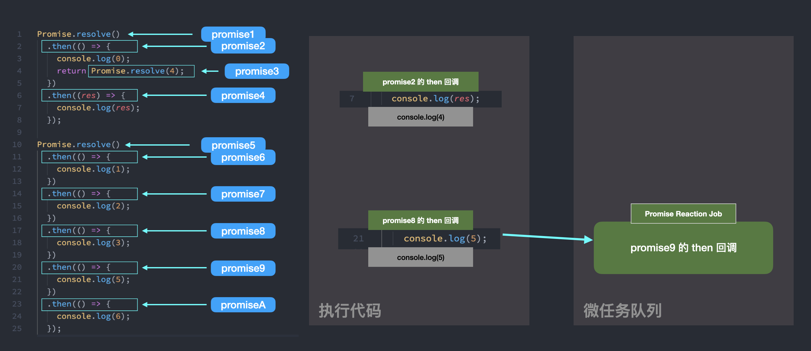

### 6. 执行一个微任务

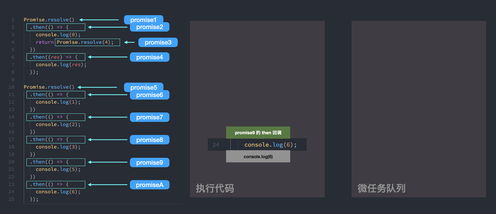

## 总结并记忆

1. `promise.then()` 中的回调，将在 promise 的状态不为 pending 时被加入到微任务队列中。这个微任务在规范中被称为 [PromiseReactionJob](https://262.ecma-international.org/11.0/#sec-newpromisereactionjob)，名称中 Reaction 是指 `then(onFulfilled, onRejected)` 调用时的回调参数 onFulfilled 和 onRejected。
2. 如果 `promise1.then()` 的回调函数的返回值是一个 Promise 对象（不妨将其命名为 promise2），那么会生成一个新微任务。 这个微任务的内容是调用 `promise2.then(resolvePromise1, rejectPromise1)`，将 promise1 和 promise2 相关联。它在规范中被称为 [PromiseResolveThenableJob](https://262.ecma-international.org/11.0/#sec-newpromiseresolvethenablejob)。

---

接下来我们通过阅读 ECMA 规范来一步步将面试题弄清楚。

# 1. 第一轮执行

面试代码在第一轮执行时，会调用 `Promise.resolve()` 和 `promise.then()` 两个函数。因为调用 `promise.then()` 时 promise 的状态可能是 fulfilled 或 pending，所以可以分为 `fulfilledPromise.then()` 和 `pendingPromise.then()`。

接下来我们根据 ECMA 规范研究下这三类函数调用。

## Promise.resolve(x)

### 结论

Promise.resolve() 返回一个状态为 fulfilled 的 promise。

### 细节

`Promise.resolve(x)` 的官方地址，请戳[这里](https://262.ecma-international.org/11.0/#sec-promise.resolve))。


规范中的 `C` 就是 `Promise`，最后返回 [`PromiseResolve(C, x)`](#)。

### PromiseResolve(C, x)

`PromiseResolve(C, x)` 的官方地址，请戳[这里](https://262.ecma-international.org/11.0/#sec-promise.resolve)。

因为我们传入的参数 x 是 `undefined`，所以只需看第三步和第四步。

第三步通过 `NewPromiseCapability(C)` 生成了新的 PromiseCapability 实例记录。

第四步是调用 promiseCapability 的 resolve 方法，将 promise 由 PENDING 状态改为 FULFILL 状态。

### NewPromiseCapability(C)

`NewPromiseCapability(C)` 的官方地址，请戳[这里](https://262.ecma-international.org/11.0/#sec-newpromisecapability)。

在规范内部通过 PromiseCapability 类型将 promise 和它的 resolve、reject 方法放在一起。

这个函数最终返回对象，如下代码所示。

```js
const promiseCapability = {
  Promise: promise,
  Resolve: resolve,
  Reject: reject,
}
```

在第四步中谈到 `GetCapabilitiesExecutor Functions` 算法功能，这里就不展开谈它了。为了方便理解，将 `NewPromiseCapability(C)` 算法编写成伪代码，结果如下。

```js
// 忽略参数 C，将 C 认为是 Promise
function NewPromiseCapability() {
  // 第三步
  const promiseCapability = {
    Promise: undefined,
    Resolve: undefined,
    Reject: undefined,
  }

  // 第四步和第五步创建一个函数
  const executor = (resolve, reject) => {
    executor.Capability.Resolve = resolve
    executor.Capability.Reject = resolve
  }

  // 第六步
  executor.Capability = promiseCapability

  // 第七步
  const promise = new Promise(executor)

  // 第十步
  promiseCapability.promise = promise

  // 第十一步
  return promiseCapability
}
```

### resolve()

在 `PromiseResolve(C, x)` 的第四步执行了 `promiseCapability.Resolve(x)`，那 `Resolve` 方法怎么定义的呢？

从 `NewPromiseCapability(C)` 我们知道 promiseCapability.Resolve 是 Promise 构造函数调用时的 resolve 参数。

我们看看 Promise 构造函数的定义。

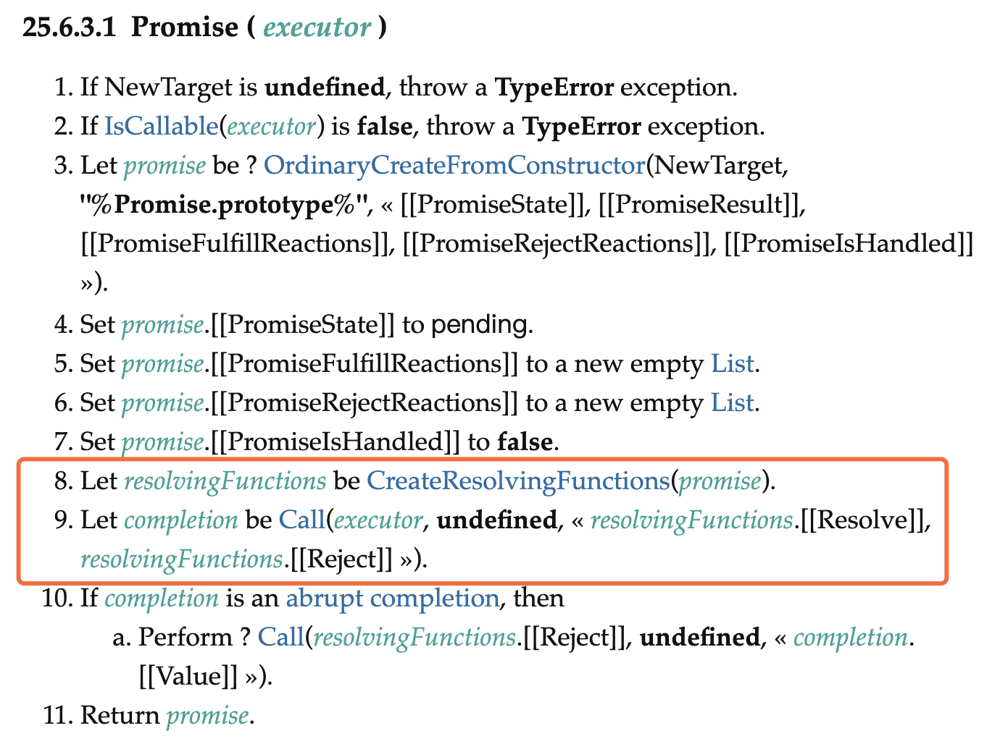

第八步和第九步就是我们要找的，我们继续进入 `CreateResolvingFunctions(promise)` 方法。

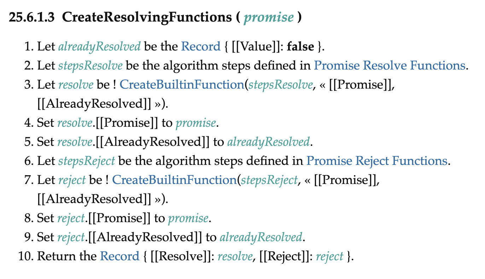

在第二步中 **Promise Resolve Functions** 就是我们要找的 resolve() 算法。

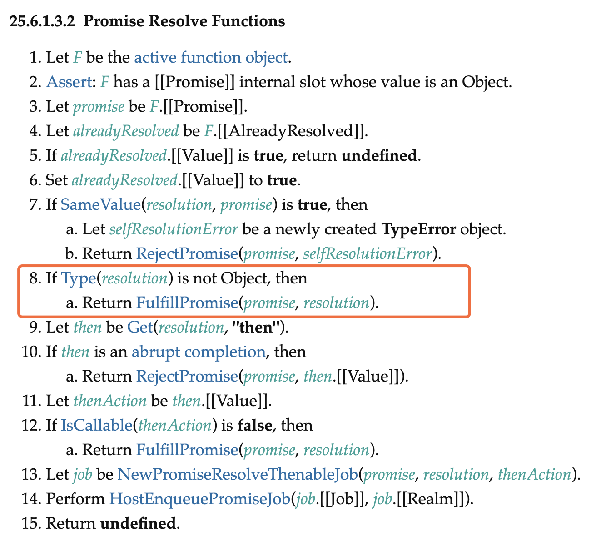

由于我们执行 `Promise.resolve()` 是参数是 `undefined`，所以进入第八步，调用 `FulfillPromise(promise, value)`。

### FulfillPromise(promise, value)

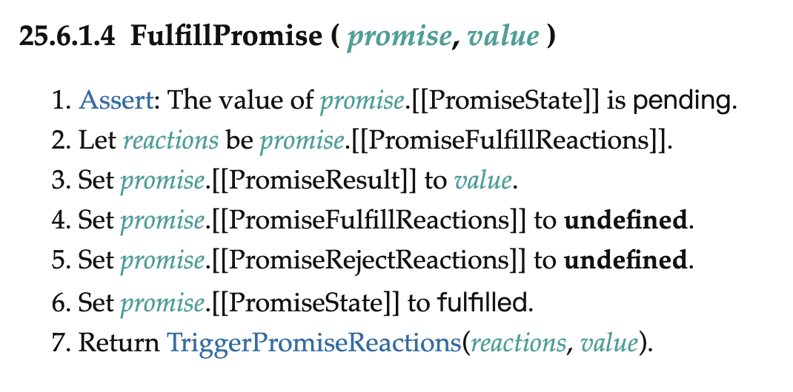

第六步将状态设置为 fulfilled。

第七步，调用 `TriggerPromiseReactions` 方法。在 `TriggerPromiseReactions` 中，由于当前 promise 的 reactions 是空数组，所以直接返回 undefined。

## fulfilledPromise.then()

根据 Promise.resolve() 的结论可知，promise1 和 promise5 的状态是 fulfilled。

### 结论

状态为 fulfilled 的 promise 执行 .then()，会向微任务队列中添加一个微任务。该微任务为 `PromiseReactionJob`，其功能是执行`fulfilledPromise.then()` 的第一个参数，并将设置其返回的 promise2 的状态。

### 细节

我们需要知道 Promise.then 方法是如何定义的。

### Promise.prototype.then(onFulfilled, onRejected)

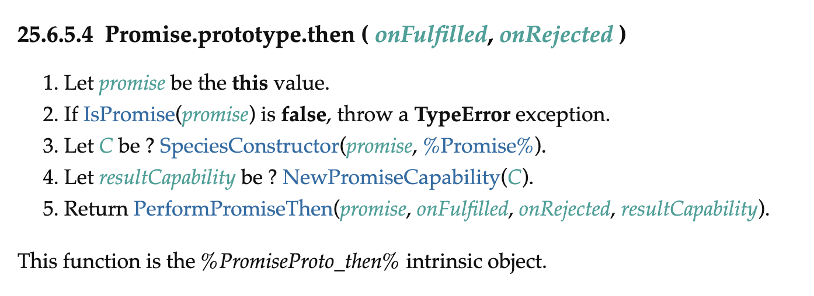

第四步会创建一个新的 Promise 对象，该对象就是调用 then() 时的返回值。

第五步会执行 `PerformPromiseThen` 方法，我们再详细看看。

### PerformPromiseThen(promise, onFulfilled, onRejected)

参考[官方地址](https://262.ecma-international.org/11.0/#sec-performpromisethen)。

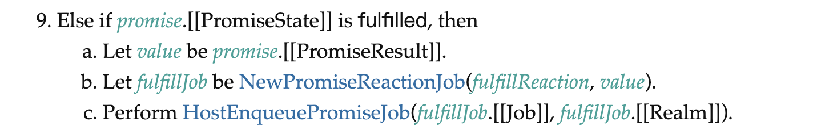

其他步骤都与题目无关，我们只看状态为 fulfilled 这条判断。

在第 9.b 步中，调用 `NewPromiseReactionJob()` 创建一个微任务。在第 9.c 步中，将该微任务添加到微任务队列中。

### NewPromiseReactionJob(reaction, promise)

参考[官方地址](https://262.ecma-international.org/11.0/#sec-newpromisereactionjob)。

在 `NewPromiseReactionJob()` 的定义中，我们只关心返回值中的 `{ Job: job }`。可以理解为 `job` 就是一个回调函数，被放入微任务队列中，然后从微任务队列中取出来并执行。

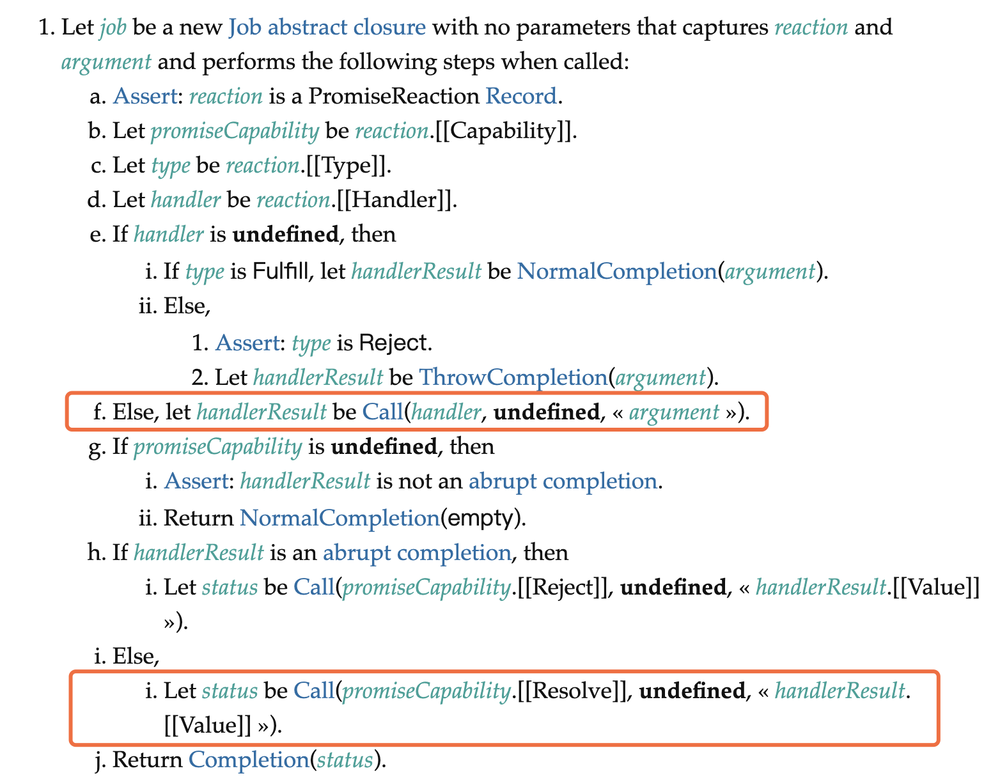

第 f 步执行 `handler(argument)`，handler 就是 `promise.then(cb)` 中的 cb。
第 i.i 步执行 `resolve()` 将 `promise.then()` 返回的 promise 对象 resolve 掉。

## pendingPromise.then()

除了 promise1、promise3 和 promise5 之外，其他 promise 都是通过 .then() 生成的，且状态都是 pending。

### 结论

状态为 pending 的 promise 调用 `then(cb)` 方法时，会将 `cb` 存到 promise 的 `[[PromiseFulfillReactions]]` 属性中。

### 细节

在 `PerformPromiseThen()` 定义中，找到符合该场景的步骤。

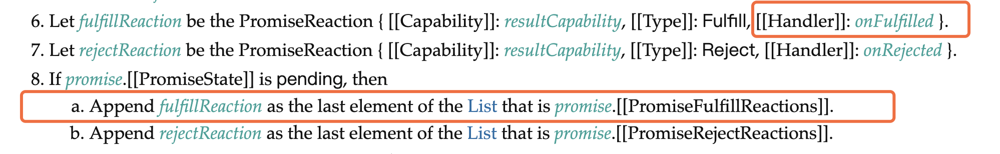

## 执行后结果

1. promise1 和 promise5 的状态为 fulfill，所以执行 `.then()` 时生成了微任务。
2. promise2、7、8、9 的 `.then()` 回调被存在 `[[PromiseFulfillReactions]]` 属性中。


# 2. 执行两个微任务

两个微任务都是执行 then 中的回调，这两个微任务是由于 fulfillPromise 调用 `.then()` 时生成的。其伪代码如下面的 job 所示。

```js
const promise = Promise.resolve()
const promise2 = promise.then(onFulfill)

function job() {
  const result = onFulfill()
  resolvePromise2(result)
}
```

继续看 resolve 方法的定义。

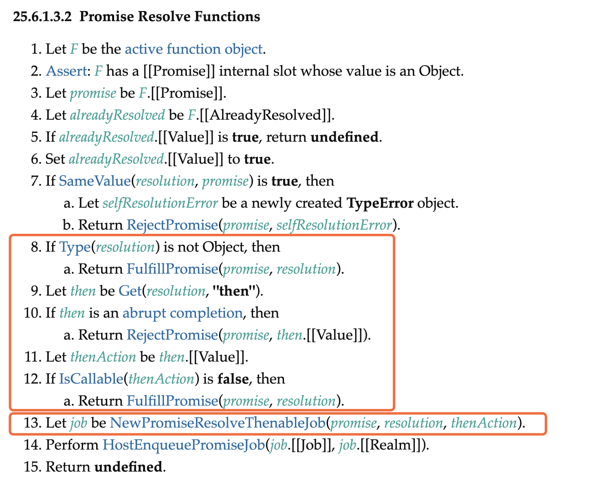

第 8 ~ 12 步的意思是，当 `result.then` 不可被调用时，就执行 `FulfillPromise()`。
第 13 步的意思是，当 `result.then` 可被调用时，就执行 `NewPromiseResolveThenableJob()` 生成微任务。

如果一个对象的 `.then` 属性可以被调用，那么我们称该对象为 thenable 对象。接下来分两种情况讨论。

## resolve(nonThenable)

当 resolve 的值不是 thenable 对象时，就会执行 `FulfillPromise()` 方法。

### FulfillPromise()


`FulfillPromise()` 第七步会执行 `TriggerPromiseReactions(reactions)`。

参数 reactions 是 promise 的 `[[PromiseFulfillReactions]]` 数组，也就是 `.then(cb)` 调用时的 cb。

### TriggerPromiseReactions()

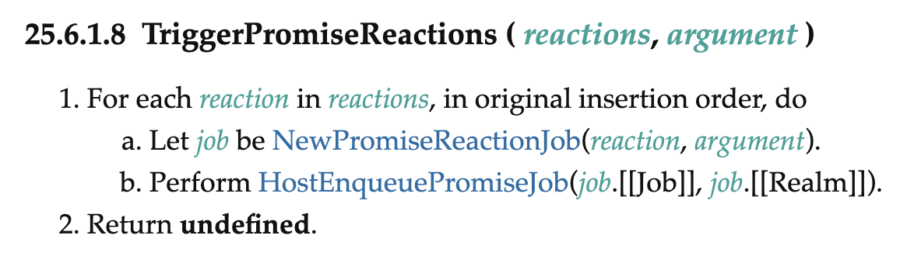

在该方法中会为每个 `.then(cb)` 的回调生成一个微任务。

## resolve(thenable)

当 resolve 的值是 thenable 对象时，会执行 `NewPromiseResolveThenableJob()` 生成新的 job。

### NewPromiseResolveThenableJob()

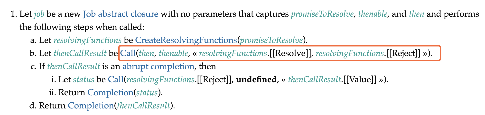

该函数生成的微任务，其任务内容伪代码如下。

```js
function job() {
  thenable.then(resolveOtherPromise, rejectOtherPromise)
}
```

## 执行后结果

1. `promise1.then(cb)` 回调的返回值是 Promise，根据规范生成了 PromiseResolveThenableJob。
2. `promise5.then(cb)` 回调的返回值是 undefined，调用 `resolvePromise6(undefined)` 后将 promise6 的状态由 pending 转变为 fulfill。在 promise6 被 fulfill 后，会将 `[[PromiseFulfillReactions]]` 列表中每项都生成一个微任务。


# 3. 执行两个微任务

## PromiseResolveThenableJob

该微任务中伪代码为：

```js
function job() {
  promise4.then(resolvePromise2, rejectPromise2)
}
```

因为 promise4 当前的状态是 fulfill，所以根据[第一轮执行结果](#)可知，`promise4.then()` 会生成一个微任务。

## PromiseReactionJob

这个微任务的内容和 [2. 执行两个微任务-resolve(nonThenable)](#) 一致，不再赘述。

## 执行结果


# 4. 执行两个微任务

两个微任务都是 PromiseReactionJob。

## 执行结果


# 5. 执行两个微任务

两个微任务都是 PromiseReactionJob。

因为 promise4 的 `[[PromiseFulfillReactions]]` 是空数组，所以不会生成新的微任务。

## 执行结果


# 6. 执行一个微任务

最后一个微任务也是 PromiseReactionJob。

因为 promiseA 的 `[[PromiseFulfillReactions]]` 是空数组，所以不会生成新的微任务。

## 执行结果


# 学废了吗

最后再出个题检验下学习成功吧。

```js
Promise.resolve()
  .then(() => {
    console.log("a")
    return Promise.resolve().then(() => {
      console.log("b")
      return "c"
    })
  })
  .then(res => {
    console.log(res)
  })

Promise.resolve()
  .then(() => {
    console.log(1)
  })
  .then(() => {
    console.log(2)
  })
  .then(() => {
    console.log(3)
  })
  .then(() => {
    console.log(4)
  })
  .then(() => {
    console.log(5)
  })
```

答案是：**a 1 b 2 3 c 4 5**

因为下面的代码会生成两个微任务。

```js
.then(() => {
  console.log("a")
  return Promise.resolve().then(() => {
    console.log("b")
    return "c"
  })
})
```

第一个微任务是 PromiseReactionJob，其内容为 `Promise.resolve().then()` 的回调。
第二个微任务是 PromiseResolveThenableJob。

# 其他 Promise 文章参考

1. [从一道让我失眠的 Promise 面试题开始，深入分析 Promise 实现细节](https://juejin.cn/post/6945319439772434469)
2. [我以为我很懂 Promise，直到我开始实现 Promise/A+规范 | 技术点评](https://juejin.cn/post/6945319439772434469)
