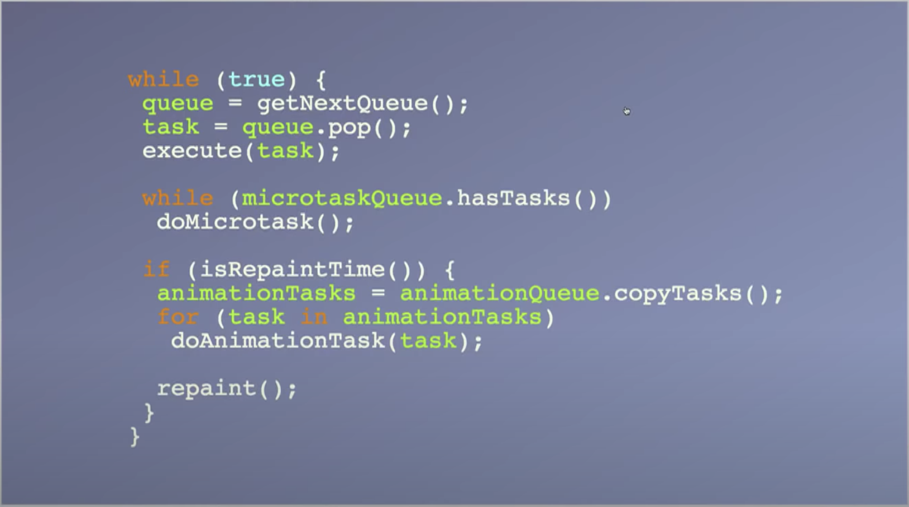
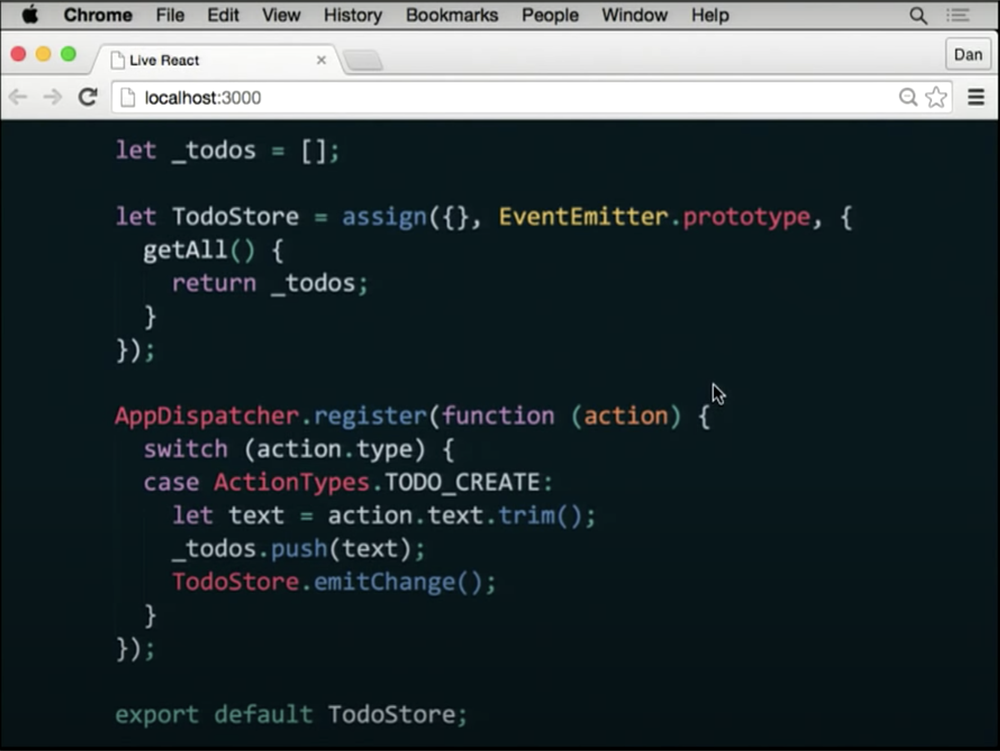
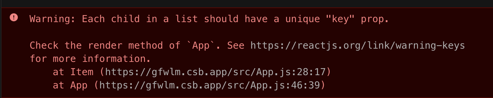
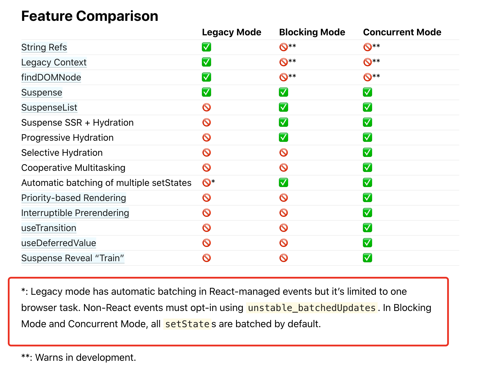
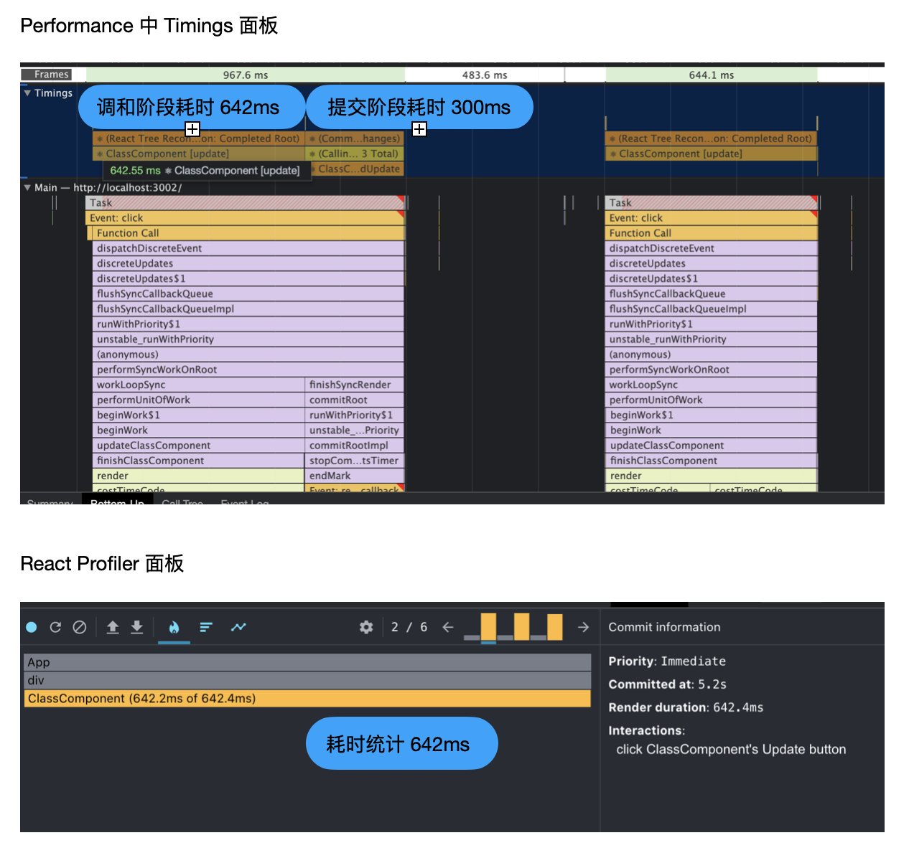
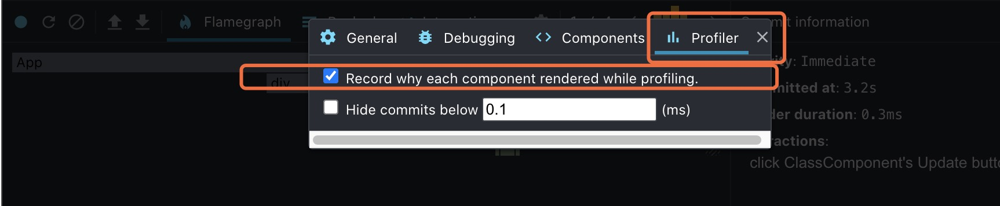

[ant-design 中 FormItem 每次渲染时都会改变都会生成新的 onChange 函数](https://github.com/ant-design/ant-design/blob/462386a9abc160f85bb20152a712d0230ffdd7d4/components/form/FormItem.tsx#L372)

本文分为三部分，首先介绍 React 的工作流，让读者对 React 组件更新流程有宏观的认识。然后列出笔者总结的一系列优化技巧，并为稍复杂的优化技巧准备了 CodeSandbox 源码，以便读者实操体验。最后分享笔者使用 React Profiler 的一点心得，帮助读者更快定位性能瓶颈。

# React 工作流

React 是声明式 UI 库，负责将 State 转换为页面结构（虚拟 DOM 结构）后，再转换成真实 DOM 结构，交给浏览器渲染。当 State 发生改变时，React 会先进行调和（Reconciliation）阶段，调和阶段结束后立刻进入提交（Commit）阶段，提交阶段结束后，新 State 对应的页面才被展示出来。

React 的调和阶段需要做两件事。 **1、计算出目标 State 对应的虚拟 DOM 结构。2、寻找「将虚拟 DOM 结构修改为目标虚拟 DOM 结构」的最优更新方案。** React 按照深度优先遍历虚拟 DOM 树的方式，在一个虚拟 DOM 上完成两件事的计算后，再计算下一个虚拟 DOM。第一件事主要是调用类组件的 render 方法或函数组件自身。第二件事为 React 内部实现的 Diff 算法，Diff 算法会记录虚拟 DOM 的更新方式（如：Update、Mount、Unmount），为提交阶段做准备。

React 的提交阶段也需要做两件事。 **1、将调和阶段记录的更新方案应用到 DOM 中。2、调用暴露给开发者的钩子方法，如：componentDidUpdate、useLayoutEffect 等。** 提交阶段中这两件事的执行时机与调和阶段不同，在提交阶段 React 会先执行 1，等 1 完成后再执行 2。因此在子组件的 componentDidMount 方法中，可以执行 `document.querySelector('.parentClass')` ，拿到父组件渲染的 `.parentClass` DOM 节点，尽管这时候父组件的 componentDidMount 方法还没有被执行。useLayoutEffect 的执行时机与 componentDidMount 相同，可参考[线上代码](https://codesandbox.io/s/cdm-yu-commit-jieduanzhixingshunxu-fzu1w?file=/src/App.js)进行验证。

由于调和阶段的「Diff 过程」和提交阶段的「应用更新方案到 DOM」都属于 React 的内部实现，开发者能提供的优化能力有限，本文仅有一条优化技巧（[列表项使用 key 属性](#heading-7))与它们有关。实际工程中大部分优化方式都集中在调和阶段的「计算目标虚拟 DOM 结构」过程，该过程是优化的重点，React 内部的 Fiber 架构和并发模式也是在减少该过程的耗时阻塞。对于提交阶段的「执行钩子函数」过程，开发者应保证钩子函数中的代码尽量轻量，避免耗时阻塞，相关的优化技巧参考本文的[避免在 didMount、didUpdate 中更新组件 State](#heading-18)。

> **拓展知识**
>
> 1. 建议对 React 生命周期不熟悉的读者结合 [React 组件的生命周期图](https://projects.wojtekmaj.pl/react-lifecycle-methods-diagram/)阅读本文。记得勾选该网站上的复选框。
> 2. 因为理解事件循环后才知道页面会在什么时候被更新，所以推荐一个[介绍事件循环的视频](https://www.youtube.com/watch?v=u1kqx6AenYw&t=853s)。该视频中事件循环的伪代码如下图，非常清晰易懂。
>    

## 定义 Render 过程

本文为了叙述方便， **将调和阶段中「计算目标虚拟 DOM 结构」过程称为 Render 过程** 。触发 React 组件的 Render 过程目前有三种方式，分别为 forceUpdate、State 更新、父组件 Render 触发子组件 Render 过程。

# 优化技巧

## PureComponent、React.memo

在 React 工作流中，如果只有父组件发生状态更新，即使父组件传给子组件的所有 Props 都没有修改，也会引起子组件的 Render 过程。从 React 的声明式设计理念来看，如果子组件的 Props 和 State 都没有改变，那么其生成的 DOM 结构和副作用也不应该发生改变。当子组件符合声明式设计理念时，就可以忽略子组件本次的 Render 过程。PureComponent 和 React.memo 就是应对这种场景的，PureComponent 是对类组件的 Props 和 State 进行浅比较，React.memo 是对函数组件的 Props 进行浅比较。

## shouldComponentUpdate

在 React 刚开源的那段时期，数据不可变性还没有现在这样流行。当时 Flux 架构就使用的模块变量来维护 State，并在状态更新时直接修改该模块变量的属性值，而不是使用[展开语法](https://developer.mozilla.org/zh-CN/docs/Web/JavaScript/Reference/Operators/Spread_syntax)生成新的对象引用。例如要往数组中添加一项数据时，当时的代码很可能是 `state.push(item)`，而不是 `const newState = [...state, item]`。这点可参考 Dan Abramov 在[演讲 Redux 时](https://www.youtube.com/watch?v=xsSnOQynTHs&t=690s)演示的 Flux 代码。



在此背景下，当时的开发者经常使用 shouldComponentUpdate 来深比较 Props，只在 Props 有修改才执行组件的 Render 过程。如今由于数据不可变性和函数组件的流行，这样的优化场景已经不会再出现了。

接下来介绍另一种可以使用 shouldComponentUpdate 来优化的场景。在项目初始阶段，开发者往往图方便会给子组件传递一个大对象作为 Props，后面子组件想用啥就用啥。当大对象中某个「子组件未使用的属性」发生了更新，子组件也会触发 Render 过程。在这种场景下，通过实现子组件的 shouldComponentUpdate 方法，仅在「子组件使用的属性」发生改变时才返回 `true`，便能避免子组件重新 Render。

但使用 shouldComponentUpdate 优化第二个场景有两个弊端。

1. 如果存在很多子孙组件，「找出所有子孙组件使用的属性」就会有很多工作量，也容易因为漏测导致 bug。
2. 存在潜在的工程隐患。举例来说，假设组件结构如下。

```jsx
<A data="{data}">
  {/* B 组件只使用了 data.a 和 data.b */}
  <B data="{data}">
    {/* C 组件只使用了 data.a */}
    <C data="{data}"></C>
  </B>
</A>
```

B 组件的 shouldComponentUpdate 中只比较了 data.a 和 data.b，目前是没任何问题的。之后开发者想在 C 组件中使用 data.c，假设项目中 data.a 和 data.c 是一起更新的，所以也没任何问题。但这份代码已经变得脆弱了，如果某次修改导致 data.a 和 data.c 不一起更新了，那么系统就会出问题。而且实际业务中代码往往更复杂，从 B 到 C 可能还有若干中间组件，这时就很难想到是 shouldComponentUpdate 引起的问题了。

> **拓展知识**
>
> 1. 第二个场景最好的解决方案是使用发布者订阅者模式，只是代码改动要稍多一些，可参考本文的优化技巧「[发布者订阅者跳过中间组件 Render 过程](#heading-10)」。
> 2. 第二个场景也可以在父子组件间增加中间组件，中间组件负责从父组件中选出子组件关心的属性，再传给子组件。相比于 shouldComponentUpdate 方法，会增加组件层级，但不会有第二个弊端。
> 3. 本文中的[跳过回调函数改变触发的 Render 过程](#heading-16)也可以用 shouldComponentUpdate 实现，因为回调函数并不参与组件的 Render 过程。

## useMemo、useCallback 实现稳定的 Props 值

如果传给子组件的派生状态或函数，每次都是新的引用，那么 PureComponent 和 React.memo 优化就会失效。所以需要使用 useMemo 和 useCallback 来生成稳定值，并结合 PureComponent 或 React.memo 避免子组件重新 Render。

> **拓展知识**
>
> useCallback 是「useMemo 的返回值为函数」时的特殊情况，是 React 提供的便捷方式。在 [React Server Hooks 代码](https://github.com/facebook/react/blob/ee432635724d5a50301448016caa137ac3c0a7a2/packages/react-dom/src/server/ReactPartialRendererHooks.js#L452) 中，useCallback 就是基于 useMemo 实现的。尽管 React Client Hooks 没有使用同一份代码，但 [useCallback](https://github.com/facebook/react/blob/ee432635724d5a50301448016caa137ac3c0a7a2/packages/react-reconciler/src/ReactFiberHooks.new.js#L1590) 的代码逻辑和 [useMemo](https://github.com/facebook/react/blob/ee432635724d5a50301448016caa137ac3c0a7a2/packages/react-reconciler/src/ReactFiberHooks.new.js#L1613) 的代码逻辑仍是一样的。

## useMemo 减少组件 Render 过程耗时

useMemo 是一种缓存机制提速，当它的依赖未发生改变时，就不会触发重新计算。一般用在「计算派生状态的代码」非常耗时的场景中，如：遍历大列表做统计信息。

> **拓展知识**
>
> 1. React 官方并不保证 useMemo 一定会进行缓存，所以可能在依赖不改变时，仍然执行重新计算。参考 [How to memoize calculations](https://reactjs.org/docs/hooks-faq.html#how-to-memoize-calculations)
> 2. 缓存优化往往是最简单有效的优化方式，但 useMemo 缓存加速只能缓存最近一次函数执行的结果，如果想缓存更多次函数执行的结果，可使用 [memoizee](https://www.npmjs.com/package/memoizee)。

## 列表项使用 key 属性

当渲染列表项时，如果不给组件设置不相等的属性 key，就会收到如下报警。


相信很多开发者已经见过该报警成百上千次了，那 key 属性到底在优化了什么呢？举个 🌰，在不使用 key 时，组件两次 Render 的结果如下。

```html
<!-- 前一次 Render 结果 -->
<ul>
  <li>Duke</li>
  <li>Villanova</li>
</ul>

<!-- 新的 Render 结果 -->
<ul>
  <li>Connecticut</li>
  <li>Duke</li>
  <li>Villanova</li>
</ul>
```

此时 React 的 Diff 算法会按照 `<li>` 出现的先后顺序进行比较，得出结果为需要更新前两个`<li>`并创建内容为 Villanova 的`li`，一共会执行两次 DOM 更新、一次 DOM 创建。

如果加上 React 的 key 属性，两次 Render 结果如下。

```html
<!-- 前一次 Render 结果 -->
<ul>
  <li key="2015">Duke</li>
  <li key="2016">Villanova</li>
</ul>

<!-- 新的 Render 结果 -->
<ul>
  <li key="2014">Connecticut</li>
  <li key="2015">Duke</li>
  <li key="2016">Villanova</li>
</ul>
```

React Diff 算法会把 key 值为 2015 的虚拟 DOM 进行比较，发现 key 为 2015 的虚拟 DOM 没有发生修改，不用更新。同样，key 值为 2016 的虚拟 DOM 也不需要更新。结果就只需要创建 key 值为 2014 的虚拟 DOM。相比于不使用 key 的代码，使用 key 节省了两次 DOM 更新操作。

如果把例子中的 `<li>` 换成自定义组件，并且自定义组件使用了 PureComponent 或 React.memo 优化。那么使用 key 属性就不只节省了 DOM 更新，还避免了组件的 Render 过程。

[React 官方推荐](https://reactjs.org/docs/lists-and-keys.html#keys)将每项数据的 ID 作为组件的 key，以达到上述的优化目的。并且不推荐使用*每项的索引*作为 key，因为传索引作为 key 时，就会退化为不使用 key 时的代码。那么是否在所有列表渲染的场景下，使用 ID 都优于使用索引呢？

答案是否定的，在常见的分页列表中，第一页和第二页的列表项 ID 都是不同，假设每页展示三条数据，那么切换页面前后组件 Render 结果如下。

```html
<!-- 第一页的列表项虚拟 DOM -->
<li key="a">dataA</li>
<li key="b">dataB</li>
<li key="c">dataC</li>

<!-- 切换到第二页后的虚拟 DOM -->
<li key="d">dataD</li>
<li key="e">dataE</li>
<li key="f">dataF</li>
```

切换到第二页后，由于所有 `<li>` 的 key 值不同，所以 Diff 算法会将第一页的所有 DOM 节点标记为删除，然后将第二页的所有 DOM 节点标记为新增。整个更新过程需要三次 DOM 删除、三次 DOM 创建。如果不使用 key，Diff 算法只会将三个 `<li>` 节点标记为更新，执行三次 DOM 更新。参考 Demo [没有添加、删除、排序功能的分页列表](https://codesandbox.io/s/meiyoutianjiashanchupaixugongnengdefenyeliebiao-d6zqr?file=/src/App.js)，使用 key 时每次翻页耗时约为 140ms，而不使用 key 仅为 70ms。

尽管存在以上场景，React 官方仍然推荐使用 ID 作为每项的 key 值。其原因有两：

1. 在列表中执行删除、插入、排序列表项的操作时，使用 ID 作为 key 将更高效。而翻页操作往往伴随着 API 请求，DOM 操作耗时远小于 API 请求耗时，是否使用 ID 在该场景下对用户体验影响不大。
2. 使用 ID 做为 key 可以维护该 ID 对应的列表项组件的 State。举个例子，某表格中每列都有普通态和编辑态两个状态，起初所有列都是普通态，用户点击第一行第一列，使其进入编辑态。然后用户又拖拽第二行，将其移动到表格的第一行。如果开发者使用索引作为 key，那么第一行第一列的状态仍然为编辑态，而用户实际希望编辑的是第二行的数据，在用户看来就是不符合预期的。尽管这个问题可以通过将「是否处于编辑态」存放在数据项的数据中，利用 Props 来解决，但是使用 ID 作为 key 不是更香吗？

## 批量更新，减少 Render 次数

我们先回忆一道前几年的 React 面试常考题，React 类组件中 setState 是同步的还是异步的？如果对类组件不熟悉也没关系，可以将 setState 理解为 useState 的第二个返回值。

balabala...

答案是：在 React 管理的事件回调和生命周期中，setState 是异步的，而其他时候 setState 都是同步的。这个问题根本原因就是 React 在自己管理的事件回调和生命周期中，对于 setState 是批量更新的，而在其他时候是立即更新的。读者可参考线上示例 [setState 同步还是异步](https://codesandbox.io/s/setstate-tongbuhuanshiyibu-1bo16)，并自行验证。

批量更新 setState 时，多次执行 setState 只会触发一次 Render 过程。相反在立即更新 setState 时，每次 setState 都会触发一次 Render 过程，就存在性能影响。

假设有如下组件代码，该组件在 `getData()` 的 API 请求结果返回后，分别更新了两个 State 。线上代码实操参考：[batchUpdates 批量更新](https://codesandbox.io/s/batchupdates-pilianggengxin-qqdsc)。

```javascript
function NormalComponent() {
  const [list, setList] = useState(null)
  const [info, setInfo] = useState(null)

  useEffect(() => {
    ;(async () => {
      const data = await getData()
      setList(data.list)
      setInfo(data.info)
    })()
  }, [])

  return <div>非批量更新组件时 Render 次数：{renderOnce("normal")}</div>
}
```

该组件会在 `setList(data.list)` 后触发组件的 Render 过程，然后在 `setInfo(data.info)` 后再次触发 Render 过程，造成性能损失。遇到该问题，开发者有两种实现批量更新的方式来解决该问题：

1. 将多个 State 合并为单个 State。例如使用 `const [data, setData] = useState({ list: null, info: null })` 替代 list 和 info 两个 State。
2. 使用 React 官方提供的 unstable_batchedUpdates 方法，将多次 setState 封装到 unstable_batchedUpdates 回调中。修改后代码如下。

```javascript
function BatchedComponent() {
  const [list, setList] = useState(null)
  const [info, setInfo] = useState(null)

  useEffect(() => {
    ;(async () => {
      const data = await getData()
      unstable_batchedUpdates(() => {
        setList(data.list)
        setInfo(data.info)
      })
    })()
  }, [])

  return <div>批量更新组件时 Render 次数：{renderOnce("batched")}</div>
}
```

> **拓展知识**
>
> 1. 推荐阅读[为什么 setState 是异步的？](https://github.com/facebook/react/issues/11527#issuecomment-360199710)
> 2. 为什么面试官不会问“函数组件中的 setState 是同步的还是异步的？”？因为函数组件中生成的函数是通过闭包引用了 state，而不是通过 this.state 的方式引用 state，所以函数组件的处理函数中 state 一定是旧值，不可能是新值。可以说函数组件已经将这个问题屏蔽掉了，所以面试官也就不会问了。可参考[线上示例](https://codesandbox.io/s/setstate-tongbuhuanshiyibu-1bo16)。
> 3. 根据[官方文档](https://reactjs.org/docs/concurrent-mode-adoption.html#feature-comparison)，在 React 并发模式中，将默认以批量更新方式执行 setState。到那时候，也可能就不需要这个优化了。

## 按优先级更新，及时响应用户

优先级更新是批量更新的逆向操作，其思想是：优先响应用户行为，再完成耗时操作。

常见的场景是：页面弹出一个 Modal，当用户点击 Modal 中的确定按钮后，代码将执行两个操作。a) 关闭 Modal。b) 页面处理 Modal 传回的数据并展示给用户。当 b) 操作需要执行 500ms 时，用户会明显感觉到从点击按钮到 Modal 被关闭之间的延迟。

例子参考：[CodeSandbox 在线 Demo](https://codesandbox.io/s/youxianjigengxinlijixiangyingyonghucaozuo-eb740)。在该例子中，用户添加一个整数后，页面要隐藏输入框，并将新添加的整数加入到整数列表，将列表排序后再展示。以下为一般的实现方式，将 `slowHandle` 函数作为用户点击按钮的回调函数。

```javascript
const slowHandle = () => {
  setShowInput(false)
  setNumbers([...numbers, +inputValue].sort((a, b) => a - b))
}
```

`slowHandle()` 执行过程耗时长，用户点击按钮后会明显感觉到页面卡顿。如果让页面优先隐藏输入框，用户便能立刻感知到页面更新，不会有卡顿感。 **实现优先级更新的要点是将耗时任务移动到下一个宏任务中执行，优先响应用户行为。** 例如在该例中，将 `setNumbers` 移动到 setTimeout 的回调中，用户点击按钮后便能立即看到输入框被隐藏，不会感知到页面卡顿。优化后的代码如下。

```javascript
const fastHandle = () => {
  // 优先响应用户行为
  setShowInput(false)
  // 将耗时任务移动到下一个宏任务执行
  setTimeout(() => {
    setNumbers([...numbers, +inputValue].sort((a, b) => a - b))
  })
}
```

## 发布者订阅者跳过中间组件 Render 过程

React 推荐将公共数据放在所有「需要该状态的组件」的公共祖先上，但将状态放在公共祖先上后，该状态就需要层层向下传递，直到传递给使用该状态的组件为止。

每次状态的更新都会涉及中间组件的 Render 过程，但中间组件并不关心该状态，它的 Render 过程只负责将该状态再传给子组件。在这种场景下可以将状态用发布者订阅者模式维护，只有关心该状态的组件才去订阅该状态，不再需要中间组件传递该状态。当状态更新时，发布者发布数据更新消息，只有订阅者组件才会触发 Render 过程，中间组件不再执行 Render 过程。

只要是发布者订阅者模式的库，都可以进行该优化。比如：redux、use-global-state、React.createContext 等。例子参考：[发布者订阅者模式跳过中间组件的渲染阶段](https://codesandbox.io/s/fabuzhedingyuezhemoshitiaoguozhongjianzujiande-render-guocheng-nm7nt?file=/src/PubSubCommunicate.js)，本示例使用 React.createContext 进行实现。

```javascript
import { useState, useEffect, createContext, useContext } from "react"

const renderCntMap = {}
const renderOnce = name => {
  return (renderCntMap[name] = (renderCntMap[name] || 0) + 1)
}

// 将需要公共访问的部分移动到 Context 中进行优化
// Context.Provider 就是发布者
// Context.Consumer 就是消费者
const ValueCtx = createContext()
const CtxContainer = ({ children }) => {
  const [cnt, setCnt] = useState(0)
  useEffect(() => {
    const timer = window.setInterval(() => {
      setCnt(v => v + 1)
    }, 1000)
    return () => clearInterval(timer)
  }, [setCnt])

  return <ValueCtx.Provider value={cnt}>{children}</ValueCtx.Provider>
}

function CompA({}) {
  const cnt = useContext(ValueCtx)
  // 组件内使用 cnt
  return <div>组件 CompA Render 次数：{renderOnce("CompA")}</div>
}

function CompB({}) {
  const cnt = useContext(ValueCtx)
  // 组件内使用 cnt
  return <div>组件 CompB Render 次数：{renderOnce("CompB")}</div>
}

function CompC({}) {
  return <div>组件 CompC Render 次数：{renderOnce("CompC")}</div>
}

export const PubSubCommunicate = () => {
  return (
    <CtxContainer>
      <div>
        <h1>优化后场景</h1>
        <div>
          将状态提升至最低公共祖先的上层，用 CtxContainer 将其内容包裹。
        </div>
        <div style={{ marginTop: "20px" }}>
          每次 Render 时，只有组件A和组件B会重新 Render 。
        </div>

        <div style={{ marginTop: "40px" }}>
          父组件 Render 次数：{renderOnce("parent")}
        </div>
        <CompA />
        <CompB />
        <CompC />
      </div>
    </CtxContainer>
  )
}

export default PubSubCommunicate
```

运行后效果：
TODO: 放图。

从图中可看出，优化后只有使用了公共状态的组件 CompA 和 CompB 发生了更新，减少了父组件和 CompC 组件的 Render 次数。

## useMemo 返回虚拟 DOM 可跳过该组件 Render 过程

利用 useMemo 可以缓存计算结果的特点，如果 useMemo 返回的是组件的虚拟 DOM，则将在 useMemo 依赖不变时，跳过组件的 Render 阶段。该方式与 React.memo 类似，但与 React.memo 相比有以下优势：

1. 更方便。React.memo 需要对组件进行一次包装，生成新的组件。而 useMemo 只需在存在性能瓶颈的地方使用，不用修改组件。
2. 更灵活。useMemo 不用考虑组件的所有 Props，而只需考虑当前场景中用到的值，也可使用 [useDeepCompareMemo](https://github.com/sandiiarov/use-deep-compare#usedeepcomparememo) 对用到的值进行深比较。

例子参考：[useMemo 跳过组件 Render 过程](https://codesandbox.io/s/usememo-tiaoguozujian-render-guocheng-bzz9r)。该例子中，父组件状态更新后，不使用 useMemo 的子组件会执行 Render 过程，而使用 useMemo 的子组件不会执行。

```javascript
import { useEffect, useMemo, useState } from "react"
import "./styles.css"

const renderCntMap = {}

function Comp({ name }) {
  renderCntMap[name] = (renderCntMap[name] || 0) + 1
  return (
    <div>
      组件「{name}」 Render 次数：{renderCntMap[name]}
    </div>
  )
}

export default function App() {
  const setCnt = useState(0)[1]
  useEffect(() => {
    const timer = window.setInterval(() => {
      setCnt(v => v + 1)
    }, 1000)
    return () => clearInterval(timer)
  }, [setCnt])

  const comp = useMemo(() => {
    return <Comp name="使用 useMemo 作为 children" />
  }, [])

  return (
    <div className="App">
      <Comp name="直接作为 children" />
      {comp}
    </div>
  )
}
```

## debounce、throttle 优化频繁触发的回调

在搜索组件中，当 input 中内容修改时就触发搜索回调。当组件能很快处理搜索结果时，用户不会感觉到输入延迟。但实际场景中，中后台应用的列表页非常复杂，组件对搜索结果的 Render 会造成页面卡顿，明显影响到用户的输入体验。

在搜索场景中一般使用 [useDebounce](https://github.com/xnimorz/use-debounce#simple-values-debouncing) + useEffect 的方式获取数据。

例子参考：[debounce-search](https://codesandbox.io/s/debounce-search-4dkn3)。

```javascript
import { useState, useEffect } from "react"
import { useDebounce } from "use-debounce"

export default function App() {
  const [text, setText] = useState("Hello")
  const [debouncedValue] = useDebounce(text, 300)

  useEffect(() => {
    // 根据 debouncedValue 进行搜索
  }, [debouncedValue])

  return (
    <div>
      <input
        defaultValue={"Hello"}
        onChange={e => {
          setText(e.target.value)
        }}
      />
      <p>Actual value: {text}</p>
      <p>Debounce value: {debouncedValue}</p>
    </div>
  )
}
```

为什么搜索场景中是使用 debounce，而不是 throttle 呢？

throttle 是 debounce 的特殊场景，throttle 给 debounce 传了 maxWait 参数，可参考 [useThrottleCallback](https://github.com/xnimorz/use-debounce/blob/master/src/useThrottledCallback.ts#L57)。在搜索场景中，只需响应用户最后一次输入，无需响应用户的中间输入值，debounce 更适合使用在该场景中。而 throttle 更适合需要实时响应用户的场景中更适合，如通过拖拽调整尺寸或通过拖拽进行放大缩小（如：window 的 resize 事件）。实时响应用户操作场景中，如果回调耗时小，甚至可以用  requestAnimationFrame 代替 throttle。

## 懒加载

在 SPA 中，懒加载优化一般用于从一个路由跳转到另一个路由。还可用于用户操作后才展示的复杂组件，比如点击按钮后展示的弹窗模块（有时候弹窗就是一个复杂页面 😌）。在这些场景下，结合 Code Split 收益较高。

懒加载的实现是通过 Webpack 的动态导入和 `React.lazy` 方法，

参考例子 [lazy-loading](https://codesandbox.io/s/lazy-loading-bmyd7)。实现懒加载优化时，不仅要考虑加载态，还需要对加载失败进行容错处理。

```javascript
import { lazy, Suspense, Component } from "react"
import "./styles.css"

// 对加载失败进行容错处理
class ErrorBoundary extends Component {
  constructor(props) {
    super(props)
    this.state = { hasError: false }
  }

  static getDerivedStateFromError(error) {
    return { hasError: true }
  }

  render() {
    if (this.state.hasError) {
      return <h1>这里处理出错场景</h1>
    }

    return this.props.children
  }
}

const Comp = lazy(() => {
  return new Promise((resolve, reject) => {
    setTimeout(() => {
      if (Math.random() > 0.5) {
        reject(new Error("模拟网络出错"))
      } else {
        resolve(import("./Component"))
      }
    }, 2000)
  })
})

export default function App() {
  return (
    <div className="App">
      <div style={{ marginBottom: 20 }}>
        实现懒加载优化时，不仅要考虑加载态，还需要对加载失败进行容错处理。
      </div>
      <ErrorBoundary>
        <Suspense fallback="Loading...">
          <Comp />
        </Suspense>
      </ErrorBoundary>
    </div>
  )
}
```

## 懒渲染

懒渲染指当组件进入或即将进入可视区域时才渲染组件。常见的组件 Modal/Drawer 等，当 visible 属性为 true 时才渲染组件内容，也可以认为是懒渲染的一种实现。

懒渲染的使用场景有：

1. 页面中出现多次的组件，且组件渲染费时、或者组件中含有接口请求。如果渲染多个带有请求的组件，由于浏览器限制了同域名下并发请求的数量，就可能会阻塞可见区域内的其他组件中的请求，导致可见区域的内容被延迟展示。
2. 需用户操作后才展示的组件。这点和懒加载一样，但懒渲染不用动态加载模块，不用考虑加载态和加载失败的兜底处理，实现上更简单。

懒渲染的实现中判断组件是否出现在可视区域内是通过 [react-visibility-observer](https://www.npmjs.com/package/react-visibility-observer) 进行监听。

例子参考：[懒渲染](https://codesandbox.io/s/lanxuanran-ls65r)

```javascript
import { useState, useEffect } from "react"
import VisibilityObserver, {
  useVisibilityObserver,
} from "react-visibility-observer"

const VisibilityObserverChildren = ({ callback, children }) => {
  const { isVisible } = useVisibilityObserver()
  useEffect(() => {
    callback(isVisible)
  }, [callback, isVisible])

  return <>{children}</>
}

export const LazyRender = () => {
  const [isRendered, setIsRendered] = useState(false)

  if (!isRendered) {
    return (
      <VisibilityObserver rootMargin={"0px 0px 0px 0px"}>
        <VisibilityObserverChildren
          callback={isVisible => {
            if (isVisible) {
              setIsRendered(true)
            }
          }}
        >
          <span />
        </VisibilityObserverChildren>
      </VisibilityObserver>
    )
  }

  console.log("滚动到可视区域才渲染")
  return <div>我是 LazyRender 组件</div>
}

export default LazyRender
```

## 虚拟列表

虚拟列表是懒渲染的一种特殊场景。虚拟列表的组件有  [react-window](https://react-window.now.sh/#/examples/list/fixed-size) 和 react-virtualized，它们都是同一个作者开发的。react-window 是 react-virtualized 的轻量版本，其 API 和文档更加友好。所以新项目中推荐使用 react-window，而不是使用 Star 更多的 react-virtualized。

使用 react-window 很简单，只需要计算每项的高度即可。下面代码中每一项的高度是 35px。

例子参考：[官方示例](https://react-window.now.sh/#/examples/list/fixed-size)

```javascript
import { FixedSizeList as List } from "react-window"
const Row = ({ index, style }) => <div style={style}>Row {index}</div>

const Example = () => (
  <List
    height={150}
    itemCount={1000}
    itemSize={35} // 每项的高度为 35
    width={300}
  >
    {Row}
  </List>
)
```

如果每项的高度是变化的，可给 itemSize 参数传一个函数。

对于这个优化点，笔者遇到一个真实案例。在公司的招聘项目中，通过下拉菜单可查看某个候选人的所有投递记录。平常这个列表也就几十条，但后来用户反馈『下拉菜单点击后要很久才能展示出投递列表』。该问题的原因就是这个候选人在我们系统中有上千条投递，一次性展示上千条投递导致页面卡住了。所以在开发过程中，遇到接口返回的是所有数据时，需提前预防这类 bug，使用虚拟列表优化。

## 跳过回调函数改变触发的 Render 过程

React 组件的 Props 可以分为两类。a) 一类是在对组件 Render 有影响的属性，如：页面数据、[getPopupContainer](https://ant.design/components/dropdown/) 和 renderProps 函数。b) 另一类是组件 Render 后的回调函数，如：onClick、[onVisibleChange](https://ant.design/components/dropdown/)。
b) 类属性并不参与到组件的 Render 过程，因为可以对 b) 类属性进行优化。当 b)类属性发生改变时，不触发组件的重新 Render ，而是在回调触发时调用最新的回调函数。

Dan Abramov 在 [A Complete Guide to useEffect](https://overreacted.io/a-complete-guide-to-useeffect/#each-render-has-its-own-event-handlers) 文章中认为，每次 Render 都有自己的事件回调是一件很酷的特性。但该特性要求每次回调函数改变就触发组件的重新 Render ，这在性能优化过程中是可以取舍的。

例子参考：[跳过回调函数改变触发的 Render 过程](https://codesandbox.io/s/tiaoguohuidiaohanshugaibianhongfade-render-guocheng-3i59n)。以下代码比较难以理解，可通过调试该例子，帮助理解消化。

```javascript
import { Children, cloneElement, memo, useEffect, useRef } from "react"
import { useDeepCompareMemo } from "use-deep-compare"
import omit from "lodash.omit"

let renderCnt = 0

export function SkipNotRenderProps({ children, skips }) {
  if (!skips) {
    // 默认跳过所有回调函数
    skips = prop => prop.startsWith("on")
  }

  const child = Children.only(children)
  const childProps = child.props
  const propsRef = useRef({})
  const nextSkippedPropsRef = useRef({})
  Object.keys(childProps)
    .filter(it => skips(it))
    .forEach(key => {
      // 代理函数只会生成一次，其值始终不变
      nextSkippedPropsRef.current[key] =
        nextSkippedPropsRef.current[key] ||
        function skipNonRenderPropsProxy(...args) {
          propsRef.current[key].apply(this, args)
        }
    })

  useEffect(() => {
    propsRef.current = childProps
  })

  // 这里使用 useMemo 优化技巧
  // 除去回调函数，其他属性改变生成新的 React.Element
  return useDeepCompareMemo(() => {
    return cloneElement(child, {
      ...child.props,
      ...nextSkippedPropsRef.current,
    })
  }, [omit(childProps, Object.keys(nextSkippedPropsRef.current))])
}

// SkipNotRenderPropsComp 组件内容和 Normal 内容一样
export function SkipNotRenderPropsComp({ onClick }) {
  return (
    <div className="case">
      <div className="caseHeader">
        跳过『与 Render 无关的 Props』改变触发的重新 Render
      </div>
      Render 次数为：{++renderCnt}
      <div>
        <button onClick={onClick} style={{ color: "blue" }}>
          点我回调，回调弹出值为 1000（优化成功）
        </button>
      </div>
    </div>
  )
}

export default SkipNotRenderPropsComp
```

## 动画库直接修改 DOM 属性，跳过组件 Render 阶段

这个优化在业务中应该用不上，但还是非常值得学习的，将来可以应用到组件库中。参考 [react-spring](https://github.com/pmndrs/react-spring)  的动画实现，当一个动画启动后，每次动画属性改变不会引起组件重新 Render ，而是直接修改了 dom 上相关属性值。

例子演示：[CodeSandbox 在线 Demo](https://codesandbox.io/s/donghuakuzhijiexiugai-domtiaoguoxuanranjieduan-ij7px)

```javascript
import React, { useState } from "react"
import { useSpring, animated as a } from "react-spring"
import "./styles.css"

let renderCnt = 0
export function Card() {
  const [flipped, set] = useState(false)
  const { transform, opacity } = useSpring({
    opacity: flipped ? 1 : 0,
    transform: `perspective(600px) rotateX(${flipped ? 180 : 0}deg)`,
    config: { mass: 5, tension: 500, friction: 80 },
  })

  // 尽管 opacity 和 transform 的值在动画期间一直变化
  // 但是并没有组件的重新 Render
  return (
    <div onClick={() => set(state => !state)}>
      <div style={{ position: "fixed", top: 10, left: 10 }}>
        Render 次数：{++renderCnt}
      </div>
      <a.div
        class="c back"
        style={{ opacity: opacity.interpolate(o => 1 - o), transform }}
      />
      <a.div
        class="c front"
        style={{
          opacity,
          transform: transform.interpolate(t => `${t} rotateX(180deg)`),
        }}
      />
    </div>
  )
}

export default Card
```

## 避免在 didMount、didUpdate 中更新组件 State

这个技巧不仅仅适用于 didMount、didUpdate，还包括 willUnmount、useLayoutEffect 和特殊场景下的 useEffect（当父组件的 cDU/cDM 触发时，子组件的 useEffect 会同步调用），本文为叙述方便将他们统称为「提交阶段钩子」。

[React 工作流](#heading-0)提交阶段的第二步就是执行提交阶段钩子，它们的执行会阻塞浏览器更新页面。如果在提交阶段钩子函数中更新组件 State，会再次触发组件的更新流程，造成两倍耗时。

一般在提交阶段的钩子中更新组件状态的场景有：

1. 计算并更新组件的派生状态（Derived State）。在该场景中，类组件应使用 [getDerivedStateFromProps](https://reactjs.org/docs/react-component.html#static-getderivedstatefromprops) 钩子方法代替，函数组件应使用[函数调用时执行 setState](https://reactjs.org/docs/hooks-faq.html#how-do-i-implement-getderivedstatefromprops)的方式代替。使用上面两种方式后，React 会将新状态和派生状态在一次更新内完成。
2. 根据 DOM 信息，修改组件状态。在该场景中，除非想办法不依赖 DOM 信息，否则两次更新过程是少不了的，就只能用其他优化技巧了。

[use-swr 的源码](https://github.com/vercel/swr/blob/0.3.8/src/use-swr.ts#L536)就使用了该优化技巧。当某个接口存在缓存数据时，use-swr 会先使用该接口的缓存数据，并在 `requestIdleCallback` 时再重新发起请求，获取最新数据。如果 use-swr 不做该优化的话，就会在 useLayoutEffect 中触发重新验证并[设置 isValidating 状态为 true](https://github.com/vercel/swr/blob/dedc017248e3de9502f5d9ff874d45de3b20ab06/src/use-swr.ts#L352)，引起组件的更新流程，造成性能损失。

# React Profiler 定位 Render 过程瓶颈

React Profiler 是 React 官方提供的性能审查工具，本文只介绍笔者的使用心得，详细的使用手册请移步[官网文档](https://zh-hans.reactjs.org/blog/2018/09/10/introducing-the-react-profiler.html)。

## Profiler 只记录了 Render 过程耗时

通过 React Profiler，开发者可以查看组件 Render 过程耗时，但无法知晓提交阶段的耗时。尽管 Profiler 面板中有 Committed at 字段，但这个字段是相对于录制开始时间，根本没有意义。所以提醒读者**不要通过 Profiler 定位非 Render 过程的性能瓶颈问题**。

通过在 React v16 版本上进行实验，同时开启 Chrome 的 Performance 和 React Profiler 统计。如下图，在 Performance 面板中，调和阶段和提交阶段耗时分别为 642ms 和 300ms，而 Profiler 面板中只显示了 642ms，没有提交阶段的耗时信息。



> **拓展知识**
>
> 1. React 在 v17 版本后已移除 User Timing 统计功能，具体原因可参考 [PR#18417](https://github.com/facebook/react/pull/18417)。
> 2. 在 v17 版本上，笔者也通过[测试代码](https://codesandbox.io/s/react-profiler-shifoutongji-componentdidmount-zhixingshijian-yosid)验证了 Profiler 中的统计信息并不包含提交阶段，有兴趣的读者可以看看。

## 开启「记录组件更新原因」

点击面板上的齿轮，然后勾选「Record why each component rendered while profiling.」，如下图。


点击面板中的虚拟 DOM 节点，右侧便会展示该组件重新 Render 的原因。


## 定位产生本次 Render 过程原因

由于 React 的批量更新（Batch Update）机制，产生一次 Render 过程可能涉及到很多个组件的状态更新。那么如何定位是哪些组件状态更新导致的呢？

在 Profiler 面板左侧的虚拟 DOM 树结构中，从上到下审查每个发生了渲染的（不会灰色的）组件。如果组件是由于 State 或 Hook 改变触发了 Render 过程，那它就是我们要找的组件，如下图。


# 结语

笔者是从年前开始写这篇文章，到发布时已经写了一个月了，期间断断续续将自己这几年对 React 的理解加入到文章中，然后调整措辞和丰富示例，最后终于在周四前完成（周四是我定的 deadline 😌）。

**既然自己付出了那么多努力，那就希望它能成为一份优秀的 React 优化手册吧。**

---

如果您对文章有疑问或者有更多优化技巧，欢迎评论。
