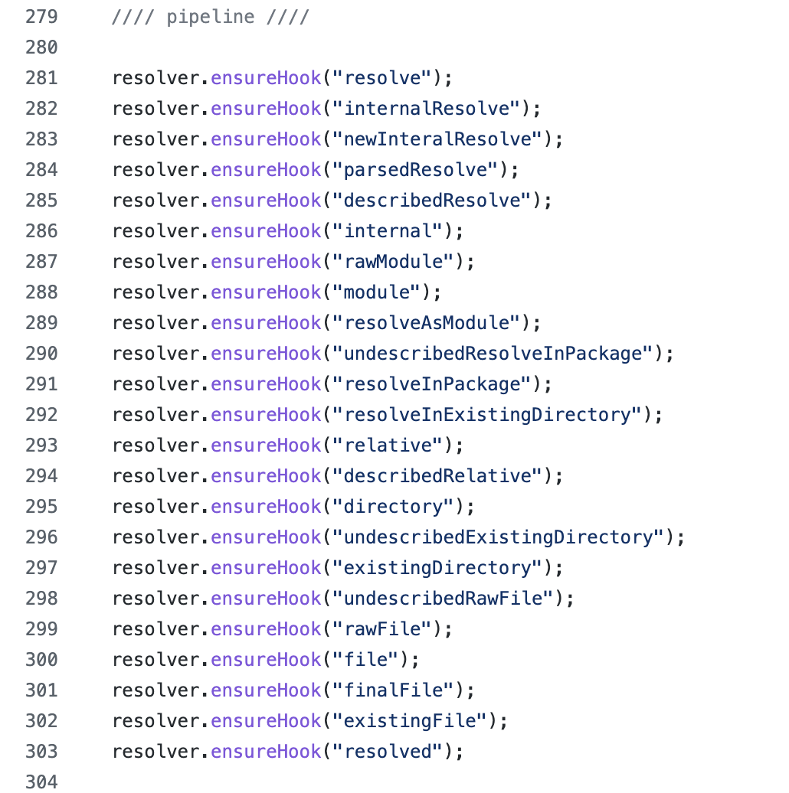
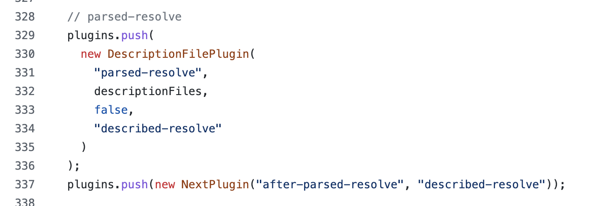

<!--
  摘要：tapable 是为了使系统更容易扩展而抽象的库。它要求将程序设计为一套流程，然后开发者可以在任意的流程节点中进行扩展，达到开发者想要扩展的目的。
-->

# 赏析 Webpack 中 tapable 插件系统（包含设计思想、使用手册和插件系统对比）

# tapable 设计思想

tapable 是为了使系统更容易扩展而抽象的库。它要求将程序设计为一套流程，然后开发者可以在任意的流程节点中进行扩展，达到开发者想要扩展的目的。

## 举个例子

假设当前程序的功能为：从列表中查找一项数据，然后重置它的属性，代码如下。

```js
function example(opts) {
  // 查找
  const found = opts.list.find(it => it.name === opts.name)
  // 重置属性
  if (found) {
    found.extra = {}
  }
}
```

假如开发者发现仅通过 `name` 查找不合理，希望改成通过 `id` 进行查找，而且还需要在重置 `extra` 属性时打印日志，方便定位问题。

然而因为上面的代码是不能支持扩展的，所以开发者只能复制一份代码，然后自己改一改。

接下来，我们将上面的例子用 tapable 进行改写，代码如下，可参考[线上 Demo](https://codesandbox.io/s/tapable-example-t7gl2)。

```js
function exampleWithTapable(opts, hooksHandler) {
  const hooks = {
    find: new SyncBailHook(["opts"], "findHook"),
    reset: new SyncHook(["item"], "resetHook"),
  }

  // 设置默认的 hook plugin
  hooks.find.tap("findByName", opts => {
    return opts.list.find(it => it.name === opts.name)
  })
  hooks.reset.tap("reset", item => {
    item.extra = {}
  })

  // 开发者可以对 Hooks 进行扩展
  if (typeof hooksHandler === "function") {
    hooksHandler(hooks)
  }

  // 执行流程
  const foundItem = hooks.find.call(opts)
  hooks.reset.call(foundItem)
}
```

如果不需要自定义行为，则直接调用该函数，其行为和 `example` 函数相同。

```js
const opts = {
  list: [
    { name: "a", id: "1", extra: { info: "1111" } },
    { name: "a", id: "2", extra: { info: "2222" } },
  ],
  name: "a",
}
exampleWithTapable(opts)
console.log("opts.list[0].extra: ", opts.list[0].extra)
```

当开发者需要对原函数进行扩展，希望实现通过 id 进行查找，并在重置属性时打印日志。代码如下：

```js
const opts2 = {
  list: [
    { name: "a", id: "1", extra: { info: "1111" } },
    { name: "a", id: "2", extra: { info: "2222" } },
  ],
  id: "2",
}
exampleWithTapable(opts2, hooks => {
  hooks.find.tap(
    {
      name: "findById",
      stage: -10,
    },
    opts => {
      return opts.list.find(it => it.id === opts.id)
    }
  )

  hooks.reset.tap("consoleResetInfo", item => {
    console.log("reset item: ", item)
  })
})
```

从上面的例子中，原函数将以前的程序定义为两个流程，分别为 find 和 reset。开发者可以在任意流程中进行扩展，实现自定义功能，但函数的主流程不会改变。

## 真实案例

在 [enhanced-resolve](https://github.com/webpack/enhanced-resolve) 这个项目中，该项目是 webpack 用于定位一个模块的真实路径的解析器。该解析算法的流程如下图所示（可[参考源码](https://github.com/webpack/enhanced-resolve/blob/60d79f3c93304ce5ecbbe0127aa583d4a73bf1a1/lib/ResolverFactory.js#L281)）。



这个流程非常清晰，流程的每一步都被提取为 Hook，并在后面的代码中为各步骤设置默认的 Plugin。比如，`parsed-resolve` 步骤的默认处理逻辑就是 `DescriptionFilePlugin` 插件，并且指明了该步骤的下一步是 `described-resolve` 步骤。



由于 enhanced-resolve 是基于 tapable 设计的可扩展库，所以开发者可以通过 webpack 的配置项 [`webpackConfig.resolve.plugins`](https://webpack.js.org/configuration/resolve/#resolveplugins) 对 Resolver 的各个阶段进行扩展。

# tapable 使用手册

## 相关术语：Hook 和 Plugin

Hook 是指流程中的每一步，比如例子中定义的 `hooks.find` 和 `hooks.reset`。

Plugin 是指一个 Hook 对应的一个处理函数，例子中通过 `tap()` 方法调用时的参数就是插件。

## Hook 的分类与初始化

Hook 分类参考[官方文档](https://github.com/webpack/tapable#hook-types)。

按照 Hook 中插件的基本执行顺序的定义，可以分为三种：

1. Sync。所有插件同步执行。
2. AsyncSeries。所有插件异步串行执行。
3. AsyncParallel。所有插件异步并行执行。

按照 Hook 中插件的返回值对插件执行顺序的影响，可以分为以下四种：

1. Basic。正常执行，插件的返回值不会影响执行顺序。
2. Waterfall。将上一个 Plugin 的返回值传给下一个 Plugin。Hook 初始化时第一个参数是上一次 Plugin 的结果，参考[源码](https://github.com/webpack/tapable/blob/acd0a66d3769120b1e9e5b66823475043237f30b/lib/__tests__/SyncWaterfallHook.js#L17-L31)。
3. Bailout。如果某个 Plugin 的返回值不是 undefined，就结束，参考[源码](https://github.com/webpack/tapable/blob/acd0a66d3769120b1e9e5b66823475043237f30b/lib/SyncBailHook.js#L15)。
4. Loop。如果某一个插件的返回值不是 undefined，那么该 Hook 会继续从第一个插件开始执行。

tapable 支持的所有 Hook 如下：

```js
const {
  SyncHook,
  SyncBailHook,
  SyncWaterfallHook,
  SyncLoopHook,
  AsyncParallelHook,
  AsyncParallelBailHook,
  AsyncSeriesHook,
  AsyncSeriesBailHook,
  AsyncSeriesWaterfallHook,
} = require("tapable")
```

所有 Hook 的初始化，有两个参数。第一个参数是定义该 Hook 的参数列表，第二个参数是该 Hook 的名称（即 `name` 字段）。

```js
const hook = new SyncHook(["arg1", "arg2", "arg3"], "hookName")

// tap 的参数通常命名和初始化一致
hook.tap("plugin", (arg1, arg2, arg3) => {
  // plugin logic
})
```

## Hook 与 tap/tapAsync/tapPromise

同步的 Hook 只支持 `tap` 方法，不能使用 `tapAsync` 和 `tapPromise` 来添加插件。

添加一个插件时可以设置该插件在插件列表的位置，通常通过 stage 来设置，默认 stage 是 0。例子中 stage 设置为 -10，则表示新加的插件应该在插件列表的最前面。

## Hook 与 call/callAsync/callPromise

异步的 Hook 只支持 `callAsync` 和 `callPromise` 调用，不支持 `call` 方法调用。

## 拦截器 interceptors

拦截器提供了四个钩子：register、call、tap 和 loop。

### register

register 钩子在一个插件通过 `tap*` 方法注册时被触发，可以修改插件的配置，参考[源码](https://github.com/webpack/tapable/blob/acd0a66d3769120b1e9e5b66823475043237f30b/lib/Hook.js#L89-L100)。

### call

call 钩子是在 Hook 通过 `call*` 方法调用时被触发。

### tap

这个钩子具有误导性，你以为它是在调用 `tap*` 方法时被触发，实际上它是在 Hook 通过 `call*` 方法调用时，调用到某个插件时才会触发。

### loop

loop 钩子是 `SyncLoopHook` 每一轮循环开始时被调用。

## Context

如果一个 `AsyncParallelHook` 触发多次，那么插件如何知道自己当前是第几次被调用呢？tapable 支持 Context，以便在一次 Hook 调用期间共享上下文信息。

支持 Context 的方式是在添加插件时，插件的 `context` 参数设置为 true。之后插件的第一个参数就是 context。

但是 Context 的支持在 tapable 库中即将被废弃掉，参考[源码](https://github.com/webpack/tapable/blob/acd0a66d3769120b1e9e5b66823475043237f30b/lib/Hook.js#L10)。

其原因是，tapable 希望 Hook 在创建时就显示命名一个参数为 `context`，之后每个插件都会收到 context 这个参数。例如在 enhanced-resolve 库中，所有 Hook 调用时的第二个参数就是 context，参考[源码](https://github.com/webpack/enhanced-resolve/blob/60d79f3c93304ce5ecbbe0127aa583d4a73bf1a1/lib/Resolver.js#L407)。

# 其他插件系统设计方式

既然 tapable 是为插件系统设计的库，那么它和其他插件模式对比，有哪些优势呢？

举个插件系统的场景，当前存在 `pluginSystem(plugins)` 这个方法，但该方法内还没有任何代码。要求是：将该方法实现为其他插件可注入逻辑，其中插件 A 注入 `console.log('a')` 逻辑，插件 B 注入 `console.log('b')` 逻辑。通过 tapable，实现代码如下，参考[线上 Demo](https://codesandbox.io/s/tapable-plugin-system-nn6bq?file=/src/tapable.js)。

```js
import { SyncHook } from "tapable"

function pluginSystem(plugins = []) {
  const hook = new SyncHook([], "PluginSystemHook")
  plugins.forEach(plugin => {
    plugin(hook)
  })

  hook.call()
}

const pluginA = hook => {
  hook.tap("pluginA", () => {
    console.log("a")
  })
}

const pluginB = hook => {
  hook.tap("pluginB", () => {
    console.log("b")
  })
}

// 使用方调用
pluginSystem([pluginA, pluginB])
```

## 回调方式

通过回调方式实现插件系统的代码如下，参考[线上 Demo](https://codesandbox.io/s/tapable-plugin-system-nn6bq?file=/src/callback.js:0-236)。

```js
function pluginSystem(plugins = []) {
  plugins.forEach(plugin => {
    plugin()
  })
}

const pluginA = () => {
  console.log("a")
}

const pluginB = hook => {
  console.log("b")
}

// 使用方调用
pluginSystem([pluginA, pluginB])
```

尽管使用回调函数实现了 `pluginSystem` 的功能，但如果插件 B 需要在插件 A 之前执行，似乎只有使用方修改调用插件系统的顺序了，这是非常不合理的。因为使用方只关心自己用了哪些插件，而不关心这些插件相互的依赖关系。（想想自己使用插件的场景，是不是这样的。）

如果使用 tapable 实现，当插件 B 需要在插件 A 之前执行时，可通过设置 before 参数即可。

```js
// 尽管插件 B 和插件 A 是由不同的开发者实现，
// 但插件 B 为了整个插件生态，可以在注册时声明自己的顺序，让它和插件 A 和睦相处。
const pluginB = hook => {
  hook.tap(
    {
      name: "pluginB",
      before: "pluginA",
    },
    () => {
      console.log("b")
    }
  )
}
```

## EventEmitter 方式

通过 Node.js 的 Events 实现插件系统的代码如下，参考[线上 Demo](https://codesandbox.io/s/tapable-plugin-system-nn6bq?file=/src/eventEmitter.js:0-413)。

```js
import ee from "events"

function pluginSystem(plugins = []) {
  const emitter = new ee()

  plugins.forEach(plugin => {
    plugin(emitter)
  })

  emitter.emit("plugin")
}

const pluginA = emitter => {
  emitter.on("plugin", () => {
    console.log("a")
  })
}

const pluginB = emitter => {
  emitter.on("plugin", () => {
    console.log("b")
  })
}

// 使用方调用
pluginSystem([pluginA, pluginB])
```

尽管插件 B 可以通过 `prependListener()` 方法使其先于插件 A 执行，但在复杂的插件系统中，还是很难精确地控制位置。除此之外，因为 EventEmitter 没有收集 listener 的返回值，所以使用 EventEmitter 不能实现 Bail 和 Waterfall 这类插件逻辑。

# 总结

tapable 是为插件系统而生的库，其目的是让插件可以在可以任意流程节点上进行扩展，并且支持在复杂的生态系统中，实现依赖关系和特殊的执行逻辑。它比通过回调函数或 EventEmitter 实现的插件系统更通用，也更灵活。

当使用 tapable 实现插件系统时，可按以下几步进行实现。

1. 为插件系统定义好流程。
2. 每个流程节点赋予一个 Hook，Hook 代表了各个插件的执行逻辑。
3. 为每个 Hook 设置默认的插件。
4. 在插件系统的合适位置调用 Hook。

---

**原创不易，别忘了点赞鼓励哦 ❤️**
