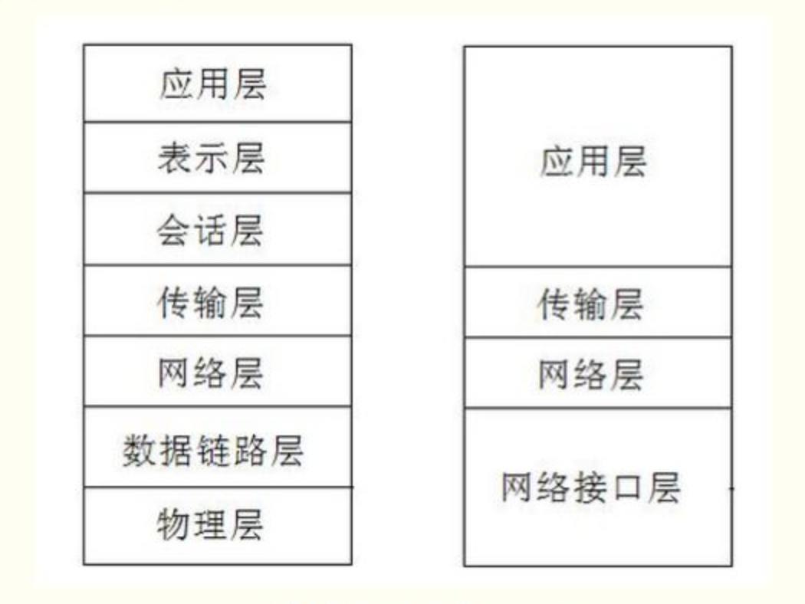
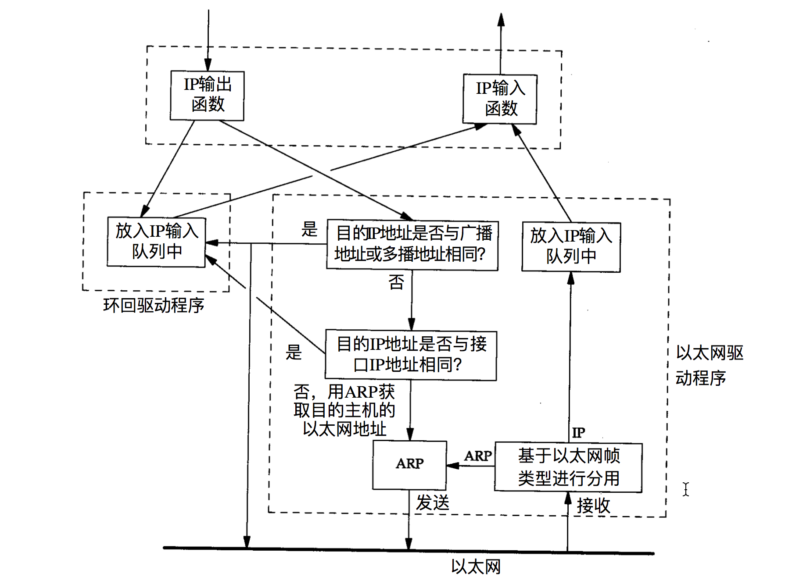

## TCP/IP 的含义
TCP/IP 和 OSI 的层次模型：

TCP/IP 指的是在 TCP/IP 四层网络模型中涉及到的所有网络协议，也称为协议族（Internet Protocol Suite）。
当我们单独地称 TCP 和 IP 时，指的仅仅是两个具体的协议。

## 互联网（internet）的含义
先有 net，后有 internet。
在80年代，大家开始把一台台计算机连接起来组成了 net。
然后随着网络地不断发展，大家又发现需要把不同的网络（net）也连接起来，所以就出现了互联网（internet）。

## internet 和 Internet 的区别
internet 意思是用一个共同的协议族把多个网络连接在一起。
Internet 是指用 TCP/IP 把多个网络连接起来。
Internet 是 internet 的一种。

## 端对端（End-to-End）与逐跳（Hop-by-Hop）
形成互联网之后，一台主机的数据就不能直接经过链路层抵达另一个网络的某台主机了。
在数据在传输过程中，会经过很多的中间层来进行数据的转发。
所以，当我们在讨论协议时，针对协议面向的目标可分为：
1. 端对端（End-to-End）。只有**互相交流的主机**需要关心。
2. 逐跳（Hop-by-Hop）。不仅**互相交流的主机**需要关心，**网络途径的中间者**也需要关心。
> 这两个概念不只是针对整个协议，对于协议细节（比如 HTTP 中的某个 Header）也经常使用它们。

## 路由器和网桥
- 路由器是在网络层上对网络进行互连，网络层提供了更多的网络如何分段的信息，使网管更利于管理路由。
- 网桥是在链路层上对网络进行互联，根据 MAC 地址来过滤和转发帧。

## 环回接口（Loopback Interface）
环回接口的目的是：支持同一台主机上的客户程序和服务器程序通过 TCP/IP 进行通信。
大多数系统把127.0.0.1分配给这个接口，并命名为 localhost。
一个传给环回接口的 IP 数据报不能在任何网络中出现。
环回接口在链路层实现，作为一个网络接口，它的功能仅仅是将收到的 IP 数据包再转发到本地机器。
下图展示了：环回接口在整个网络层和链路层的交互中所起的作用。

## 网络接口的选择
发送端通过路由表根据目的 IP 地址选择网络接口。
接收端找到本机与目的 IP 地址相匹配的网络接口。