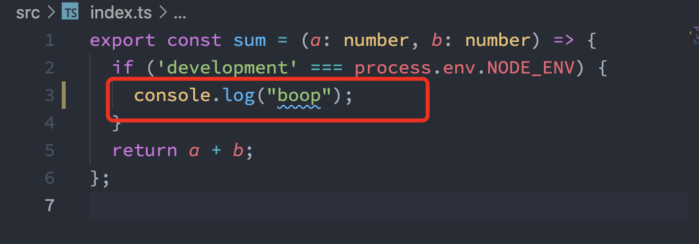

# 如何用 TypeScript 语言实现一款支持浏览器和 Node.js 的通用 SDK

# 背景

项目中需要实现一款 SDK，该 SDK 需要满足的条件有：

1. 使用 TS 语言，支持 lint 和 test。
2. 支持 Node.js 端运行并且最低版本为 v10。
3. 支持浏览器端运行且可以通过 browserslist 对支持的浏览器进行配置。

# TL;DR

本文对应的 SDK 项目仓库为 [universal-sdk-by-tsdx](https://github.com/MoonBall/universal-sdk-by-tsdx)。

如果你更愿意通过阅读代码的方式了解实现原理，那么克隆该项目并阅读源码将非常适合你。

在该项目中执行 `git log`，将展示详细的实践步骤，这对理解项目的迭代过程非常有帮助。

# 选择 tsdx

选择 tsdx 的原因是它能快速搭建 TS 的配置，其中包括：

- lint 和 test
- prettier
- vscode 友好的 lint 提示
- 可以直接构建出 cjs/esm/umd 格式的输出文件

## 通过 tsdx 创建项目

```shell
npx tsdx create universal-sdk-by-tsdx
# 选择 basic 即可

cd universal-sdk-by-tsdx
```

选择完 tsdx 后，剩下的工作就是对配置 tsdx 了。

### 验证 eslint

当把 `src/index.ts` 中的 `'boop'` 字符串中的单引号改成双引号时，vscode 并没有报错。



需要执行 `yarn lint --write-file`，这个命令将在项目更目录生成 `.eslintrc.js` 文件。重启 vscode，将看到 eslint 提示的报错信息。


### 验证 vscode 代码格式化

将 vscode 中的代码格式化配置为 prettier 插件，格式化可以生效，不会走默认 prettier 配置。因为 SDK 项目中的 'package.json' 中包含 [`prettier` 字段](https://github.com/MoonBall/universal-sdk-by-tsdx/blob/f0ef56d62c995279b9d67846fb598ede8930e62b/package.json#L28-L33)。
