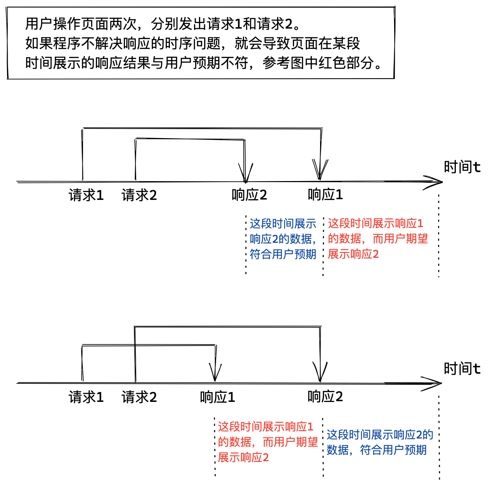

# 为什么使用 useSWR

1. 实现加载中、错误态等状态。业务代码往往需要在每个接口调用处维护这两个状态。
2. 请求时序问题。组件内部与搜索相关的 state 或者 props 都可能改变。

## 特点

1. 数据依赖，如果 key 函数报错，返回值将为

有个 bug。initVal 传了后，mutate 有时候的值是 undefined，很奇怪。

```js
setTimeout(() => {
  delete CONCURRENT_PROMISES[key]
  delete CONCURRENT_PROMISES_TS[key]
}, config.dedupingInterval)
```

这里可能有问题，可能把不是自己这次的请求给删掉了。

# 开启 SWR 之旅，简化数据的查询与管理

在介绍 SWR 之前，我们实现一个最简单的带有数据请求的 React 组件。

```js
function CompWithFetch() {
  const [data, setData] = useState()
  useEffect(() => {
    ;(async () => {
      try {
        const data = await fetchData()
        setData(data)
      } catch (err) {
        Message.error("服务端错误")
        // Hint: 优秀的代码，一定要 rethrow error，不要将错误吃掉
        throw err
      }
    })()
  }, [])

  return <div>{data}</div>
}
```

如果经常写这样的代码，那么肯定会想到自己封装一个 React Hook，该 Hook 以请求函数作为参数。

```js
function useFetch(fetcher) {
  const [data, setData] = useState()
  const fetch = useCallback(async () => {
    try {
      const data = await fetcher()
      setData(data)
    } catch (err) {
      Message.error("服务端错误")
      // Hint: 优秀的代码，一定要 rethrow error，不要将错误吃掉
      throw err
    }
  }, [fetcher])

  // fetcher 改变就再次获取数据
  useEffect(() => {
    fetch()
  }, [fetch])

  return {
    data,
    // 暴露 fetch 给使用方，以便重新拉取数据
    fetch,
  }
}
```

这样就完成了一个非常迷你的 useSWR 了。调用方需通过 useCallback 生成稳定的 fetcher 引用值，这点是为了在请求带有参数时，参数改变后 useFetch 将重新发起请求。暴露给调用方的 fetch 函数，可以应对主动刷新的场景，比如页面上的刷新按钮。

尽管 `useFetch` 可以在一部分场景中复用，但是与 useSWR 相比，它的抽象程度还不够，比如：要求调用方使用 useCallback 来生成 fetcher 就是模板代码等等。

进入正题，接下来我们一起看看 useSWR 内部抽象了多少通用功能，为什么选择使用它？

# 为什么使用 useSWR

## 1、实现了错误状态和加载状态

useSWR 不仅和我们实现的 `useFetch` 一样好用，它的返回值还有错误状态 error 和加载状态 isValidating。如果你曾经为每个请求都写过一次 `try catch` 和`setState(true)`，那么用上它后代码将简洁不少。

```js
// 使用 useSWR 实现带有数据请求的 React 组件，和 useFetch 一样简洁。
function CompWithFetch() {
  // key 可了解为某个请求的 ID，用于全局缓存该请求，可先不管
  const { data, error, isValidating } = useSWR(key, fetcher)

  return <div>{data}</div>
}
```

除了简洁之外，useSWR 还对 data/error/isValidating 做了优化，避免引起不必要的渲染。比如业务场景只关心请求的结果，当请求结果中数据不存在时，就在页面上展示占位符 -。由于该场景并不关心加载状态和错误状态，那么 useSWR 就只会在 data 发生改变时才触发组件重新渲染。该优化通过 `Object.defineProperties` 实现，可参考[源码](https://github.com/vercel/swr/blob/master/src/use-swr.ts#L753)。

## 2. 解决了请求时序问题

请求的时序问题是指用户操作页面两次，先后发出了请求 1 和请求 2，用户期望页面展示请求 2 的数据，但页面却展示了请求 1 的数据。


为了保证程序的正确性，在搜索查询的页面和模块中，都需要解决时序问题。以往解决时序最简单的方法是使用一个递增的整数，每次请求结束都会用该整数判断当前请求是否是最后一个请求。如果是最后一个请求才使用它的响应结果，否则就忽略它。

```js
// 实现最简单的时序问题处理
```

使用 useSWR 后，我们就无需关心时序问题了，因为它内部只会使用最后一次请求的数据。

## 3. 天然的全局状态方便多组件复用

数据请求我们一般都会将其写在组件内部，因为当时只有一个组件会使用到该请求，同时也符合软件设计高内聚的思想。但如果多个组件需要共用该请求的数据，通常我们会将数据放到 Context 或 Redux 中。在实现该功能时，不仅要将数据移动到上层，还要修改更新数据的代码，繁琐且容易出错。

另一种解决办法是在需要该请求数据的多个组件中，都调用我们实现的 `useFetch` Hook。但是该方法有两个缺点。1.每个组件各自维护了一份数据，如果前端需要更新数据，那么两份数据如何同步就会变得很困难。2.每个组件都会发起一次请求，且不说对同一个请求发出多次多么糟糕，而且也可能存在两次请求的结果存在数据不一致的情况。由于这些缺点，所以还是使用全局数据管理更靠谱些。

useSWR 内部便是通过全局数据实现，如果调用 `useSWR(key, fetcher)` 的 key 一样，它们就会使用同一份数据。如果我们使用 useSWR 在组件 A 中使用了请求 `/api/data` 的数据，代码如下。

```js
// 在组件 A 中获取请求 `/api/data` 的数据
function CompA() {
  const { data } = useSWR("/api/data", async () => {
    await new Promise(r => setTimeout(r, 500))
    return "MoonBall"
  })
  return <div>组件A：{data || "-"}</div>
}
```

随后组件 B 也需要使用该请求。那么我们先复制一下代码看看效果。

```js
// 在组件 B 中也获取请求 `/api/data` 的数据
function CompB() {
  const { data } = useSWR("/api/data", async () => {
    await new Promise(r => setTimeout(r, 500))
    return "MoonBall"
  })
  return <div>组件B：{data || "-"}</div>
}
```

只要 CompA 和 CompB 的挂载时间之差小于 [dedupingInterval（默认值是 2000ms）](https://swr.vercel.app/zh-CN/docs/options) ，useSWR 就只会发出一次请求。如果页面是同时展示组件A 和组件B，那么基本上不会发出两次请求，毕竟2秒都不够用，页面也太卡了，用户也该喷了。如果页面先展示组件A，用户点击按钮后才展示组件B，组件A和B的挂载时间超过了 2s，那么组件B挂载时重新获取数据也是合理的，毕竟上次获取的请求数据可能已经是脏数据了（因为服务端更新了数据）。当然某些场景中，我们就是不想 B 重新发起请求，因为如果数据有更新了，就会导致组件A重新 Render，进一步导致莫名其妙的 bug 或性能问题。这时可以给组件 B 传 `revalidateOnMount: false`，让组件 B 在挂载时不会发起请求。

随后 接下来我们再简化下代码，将请求相关的公共代码提炼为函数 `useData`，然后再组件A和组件B中调用 `useData` 即可，非常简洁。

```js
function useData(revalidateOnMount) {
  return useSWR("/api/data", async () => {
    await new Promise(r => setTimeout(r, 500))
    return "MoonBall"
  }, {
    revalidateOnMount
  })
}

function CompA() {
  const { data } = useData();
  return <div>组件A：{data || "-"}</div>
}

function CompB() {
  // 根据需求，可以传参 false，来避免组件 B 在挂载时发起请求
  const { data } = useData();
  return <div>组件B：{data || "-"}</div>
}
```


## 4. 轻松实现数据预加载

## 5. 其他

# 声明式的数据请求方式

介绍与命令式的区别，以及如何命令式触发数据请求。

## 与命令方式的区别

## 如何命令式地触发数据请求

## 条件请求

## 如何修改数据

# 最佳实践

## Error 处理

掉调用 `useSWR(key, fetcher)` 时，如果 fetcher

将 Hook 设置在模块中

# 所有配置的解析

# 存在缺点

## 全局 key 命名问题

基本上都是随意命名的。因为往往在模块级别的 key 会有其他参数，所以还好。

## 只能在 React 组件中拿到最新的请求结果

全局状态

## 未提供请求中断的 API

## 配置基于请求还是基于组件，傻傻分不清


# FAQ

## useSWR 会导致内存泄露吗？


